# 04 - Guía de estilos y prototipado

La guía de estilos define la identidad visual de Blíster y las reglas técnicas que permiten mantener una interfaz coherente. Este capítulo recoge el enlace al prototipo, la paleta, tipografía, espaciado, arquitectura CSS, componentes reutilizables y espacios reservados para incorporar capturas visuales en la entrega.

## Índice

1. [Prototipo](#1-prototipo)
	- 1.1 [Enlace y alcance](#11-enlace-y-alcance)
	- 1.2 [Relación con la implementación](#12-relación-con-la-implementación)
2. [Identidad visual](#2-identidad-visual)
	- 2.1 [Personalidad de marca](#21-personalidad-de-marca)
	- 2.2 [Uso del nombre y tono visual](#22-uso-del-nombre-y-tono-visual)
3. [Paleta cromática](#3-paleta-cromática)
	- 3.1 [Colores principales](#31-colores-principales)
	- 3.2 [Colores semánticos y de dominio](#32-colores-semánticos-y-de-dominio)
	- 3.3 [Tema oscuro](#33-tema-oscuro)
4. [Tipografía](#4-tipografía)
	- 4.1 [Familias tipográficas](#41-familias-tipográficas)
	- 4.2 [Escala de texto](#42-escala-de-texto)
	- 4.3 [Legibilidad y dislexia](#43-legibilidad-y-dislexia)
5. [Espaciado, bordes, radios y sombras](#5-espaciado-bordes-radios-y-sombras)
	- 5.1 [Espaciado](#51-espaciado)
	- 5.2 [Bordes y radios](#52-bordes-y-radios)
	- 5.3 [Sombras](#53-sombras)
6. [Arquitectura CSS](#6-arquitectura-css)
	- 6.1 [ITCSS](#61-itcss)
	- 6.2 [BEM](#62-bem)
	- 6.3 [Variables CSS](#63-variables-css)
7. [Componentes reutilizables](#7-componentes-reutilizables)
	- 7.1 [Botones y acciones](#71-botones-y-acciones)
	- 7.2 [Campos de formulario](#72-campos-de-formulario)
	- 7.3 [Cards y filas](#73-cards-y-filas)
	- 7.4 [Navegación y menús](#74-navegación-y-menús)
	- 7.5 [Estados de sistema](#75-estados-de-sistema)
8. [Mockups y capturas de pantallas principales](#8-mockups-y-capturas-de-pantallas-principales)
	- 8.1 [Capturas pendientes de sustituir](#81-capturas-pendientes-de-sustituir)
	- 8.2 [Pantallas documentadas](#82-pantallas-documentadas)
9. [Accesibilidad visual](#9-accesibilidad-visual)
	- 9.1 [Contraste](#91-contraste)
	- 9.2 [Áreas táctiles](#92-áreas-táctiles)
	- 9.3 [Iconografía y ARIA](#93-iconografía-y-aria)

## 1. Prototipo

### 1.1 Enlace y alcance

El prototipo funcional de Blíster está disponible en Figma y sirve como referencia visual para las pantallas, jerarquías, flujo de entrada y experiencia mobile-first.

URL del prototipo:

```text
https://www.figma.com/proto/ij5gM2auQ6ZaJTTvSnkkZo/Bl%C3%ADster?node-id=97-133&t=eu3HSsCkrQK42KJW-1&scaling=scale-down&content-scaling=fixed&page-id=0%3A1&starting-point-node-id=97%3A133&show-proto-sidebar=1
```

El enlace corresponde a la navegación pública del prototipo y permite comprobar el recorrido inicial previsto para la aplicación. Para la entrega final conviene acompañarlo con capturas exportadas desde Figma o desde la aplicación real, porque la rúbrica valora tanto la existencia del prototipo como la evidencia visible en la documentación.

### 1.2 Relación con la implementación

La implementación actual no depende de componentes exportados desde Figma. La fuente de verdad de la interfaz está en los componentes React y en los tokens SCSS del proyecto.

El prototipo actúa como referencia de intención visual: jerarquía, tono, densidad, composición mobile-first y estilo de superficies. La aplicación implementada ha evolucionado sobre esa base para incorporar estados reales, permisos, formularios, validaciones, notificaciones, privacidad y escritorio con marco móvil.

## 2. Identidad visual

### 2.1 Personalidad de marca

Blíster se presenta como una herramienta sanitaria doméstica: clara, cercana y fiable. La identidad evita una estética clínica fría y prioriza que el usuario pueda leer rápido qué medicamento tiene, cuándo debe tomarlo y qué acción puede realizar.

| Atributo | Traducción visual |
| :--- | :--- |
| Cuidado | Interfaz amable, lenguaje directo y componentes con aire suficiente. |
| Rigor | Datos oficiales CIMA, estados claros y alertas diferenciadas. |
| Calma | Paleta verde, superficies limpias y uso contenido del color de advertencia. |
| Seguridad | Confirmaciones, mensajes de error visibles y acciones destructivas diferenciadas. |

La personalidad se apoya en una idea principal: la aplicación debe acompañar sin dramatizar. El dominio de salud exige rigor, pero el contexto de uso es doméstico; por eso la interfaz evita una imagen hospitalaria rígida y busca un equilibrio entre confianza, serenidad y acción inmediata.

### 2.2 Uso del nombre y tono visual

El nombre se escribe como **Blíster** cuando se refiere al producto. En el código aparecen nombres técnicos sin tilde cuando una ruta, variable o archivo lo requiere.

El tono visual prioriza textos cortos, titulares claros y etiquetas funcionales. Las pantallas no introducen explicaciones decorativas dentro de la interfaz; cuando una acción necesita contexto, se utiliza ayuda puntual, feedback inline o una confirmación. Esta decisión reduce ruido en móvil y mantiene el foco en la tarea sanitaria.

## 3. Paleta cromática

Los colores se definen en `frontend/src/scss/00-settings/_colors.scss` mediante variables CSS. Los componentes consumen tokens, no valores hexadecimales sueltos.

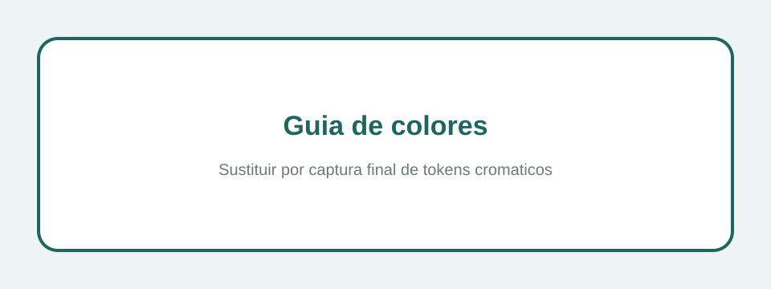

### 3.1 Colores principales

| Token | Valor | Uso |
| :--- | :--- | :--- |
| `--color-primary` | `#1e6660` | Botones principales, enlaces activos y acciones relevantes. |
| `--color-primary-mid` | `#11a498` | Indicadores, barras de progreso y fondo de marca. |
| `--color-primary-subtle` | `#67c2bb` | Avatares, chips suaves y acentos secundarios. |
| `--color-accent` | `#d97757` | Terracota para palabras destacadas y avisos no críticos. |
| `--color-bg` | `#f5f5f5` | Fondo general claro. |
| `--color-surface` | `#ffffff` | Formularios, cards y superficies. |

### 3.2 Colores semánticos y de dominio

| Token | Significado |
| :--- | :--- |
| `--color-success` | Estado correcto o acción completada. |
| `--color-warning` | Atención necesaria, como stock bajo. |
| `--color-error` | Error, stock crítico o caducidad vencida. |
| `--color-info` | Información neutral, especialmente citas. |
| `--color-dose-taken` | Toma registrada. |
| `--color-dose-pending` | Toma pendiente. |
| `--color-stock-ok` | Stock suficiente. |
| `--color-stock-low` | Stock bajo. |
| `--color-stock-critical` | Stock agotado o crítico. |
| `--color-expired` | Medicamento caducado. |

### 3.3 Tema oscuro

El tema oscuro se activa con `data-theme="dark"` en el elemento `html`. Los componentes no consultan directamente `prefers-color-scheme`; consumen los mismos tokens con valores redefinidos para mantener coherencia.

## 4. Tipografía

La tipografía se define en `frontend/src/scss/00-settings/_typography.scss`. La combinación busca legibilidad en móvil y personalidad en pantallas de marca.

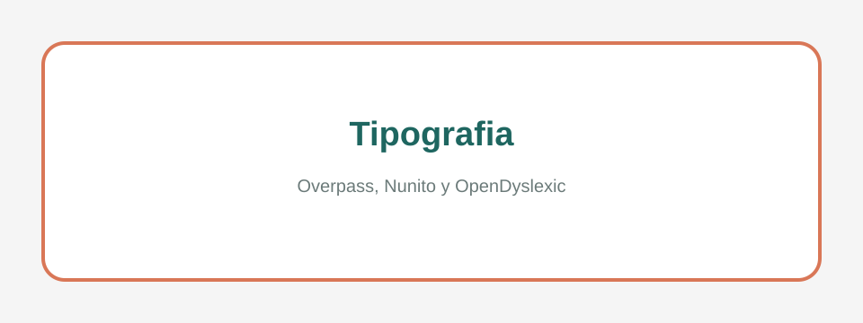

### 4.1 Familias tipográficas

| Token | Familia | Uso |
| :--- | :--- | :--- |
| `--font-display` | Overpass | H1, onboarding y títulos de alto impacto. |
| `--font-body` | Nunito | Texto general, formularios, navegación y cards. |
| `--font-dyslexia` | OpenDyslexic | Modo de lectura accesible. |

Overpass se reserva para momentos de identidad y jerarquía fuerte. Nunito sostiene la aplicación diaria porque resulta amable en tamaños pequeños. OpenDyslexic se ofrece como opción de accesibilidad, no como tipografía por defecto, para que cada usuario pueda decidir si mejora su lectura.

### 4.2 Escala de texto

La escala usa tokens como `--text-xs`, `--text-sm`, `--text-base`, `--text-lg`, `--text-xl`, `--text-2xl` y superiores. El tamaño base puede modificarse con `data-text-size="large"` o `data-text-size="xlarge"`.

La escala evita que cada componente decida tamaños aislados. En cards, formularios y navegación se usan tamaños intermedios para que el contenido entre en pantallas móviles sin perder legibilidad. Los tamaños mayores se reservan para onboarding, títulos de página y mensajes de estado.

### 4.3 Legibilidad y dislexia

La legibilidad se refuerza con altura de línea suficiente, pesos moderados y contraste entre texto principal, texto secundario y estados. El selector de fuente disléxica cambia la familia sin modificar la estructura del layout, por lo que la interfaz conserva espaciados y áreas táctiles.

Los mensajes de error se muestran junto al campo afectado y en español, evitando que la persona tenga que interpretar códigos técnicos o mensajes en inglés.

## 5. Espaciado, bordes, radios y sombras

El sistema visual centraliza medidas para reducir inconsistencias entre pantallas.

### 5.1 Espaciado

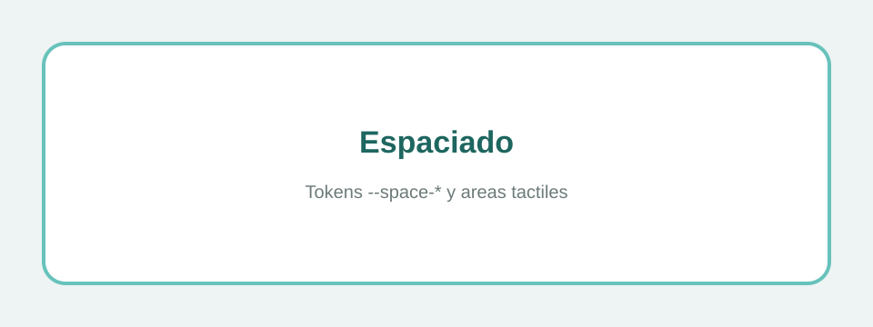

| Token | Equivalencia | Uso |
| :--- | :--- | :--- |
| `--space-1` | 0.25rem | Separación mínima. |
| `--space-2` | 0.5rem | Elementos compactos. |
| `--space-4` | 1rem | Separación estándar. |
| `--space-6` | 1.5rem | Bloques internos. |
| `--space-8` | 2rem | Separación entre secciones. |
| `--space-touch-min` | 2.75rem | Área táctil mínima de 44 px. |
| `--space-bottom-nav-height` | 4.75rem | Altura de navegación inferior. |

### 5.2 Bordes y radios

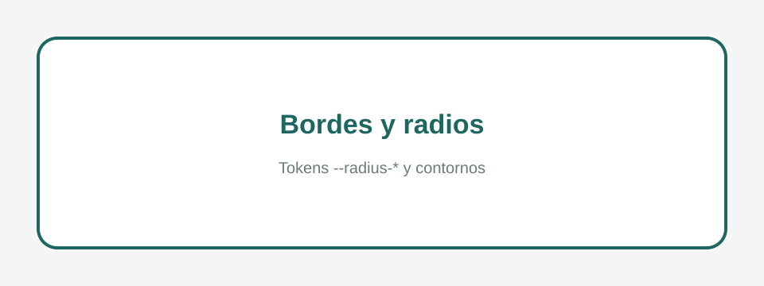

| Token | Uso |
| :--- | :--- |
| `--radius-sm` | Inputs, badges y tooltips. |
| `--radius-md` | Cards y paneles estándar. |
| `--radius-lg` | Cards de medicamento y bottom sheets. |
| `--radius-xl` | Modales o superficies amplias. |
| `--radius-full` | Avatares, chips, toggles y botones circulares. |

### 5.3 Sombras

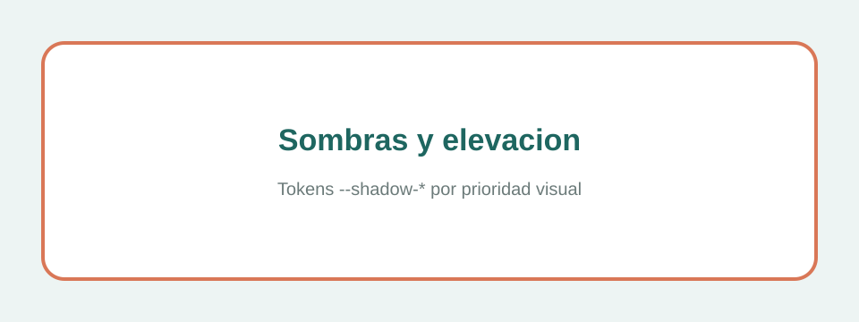

| Token | Uso |
| :--- | :--- |
| `--shadow-sm` | Separación sutil en listas. |
| `--shadow-md` | Dropdowns, modales y bottom sheets. |
| `--shadow-lg` | Toasts y superficies de máxima prioridad. |
| `--shadow-card-soft` | Cards principales. |
| `--shadow-device` | Marco de dispositivo móvil en escritorio. |

## 6. Arquitectura CSS

La arquitectura de estilos sigue ITCSS y BEM. La entrada global es `frontend/src/scss/main.scss` y las capas se importan de menor a mayor especificidad.

```scss
@use '00-settings' as settings;
@use '01-tools' as tools;
@use '02-generic' as generic;
@use '03-elements' as elements;
@use '04-objects' as objects;
@use '05-components' as components;
@use '06-utilities' as utilities;
```

### 6.1 ITCSS

| Capa | Responsabilidad |
| :--- | :--- |
| `00-settings` | Tokens y variables globales. |
| `01-tools` | Mixins y funciones SCSS. |
| `02-generic` | Reset y normalización. |
| `03-elements` | Estilos base de etiquetas HTML. |
| `04-objects` | Patrones de layout sin apariencia de marca. |
| `05-components` | Componentes concretos de interfaz. |
| `06-utilities` | Utilidades controladas. |

La ventaja de ITCSS en este proyecto es que permite escalar pantallas nuevas sin aumentar la especificidad de forma desordenada. Los tokens y herramientas aparecen primero; los componentes concretos llegan después; y las utilidades quedan al final para ajustes pequeños y explícitos.

### 6.2 BEM

La nomenclatura BEM utiliza prefijos: `.c-` para componentes, `.o-` para objetos de layout y `.u-` para utilidades.

Ejemplos reales de la aplicación:

| Prefijo | Ejemplo | Significado |
| :--- | :--- | :--- |
| `.c-` | `.c-appointment-card` | Componente con aspecto propio. |
| `.o-` | `.o-stack` | Objeto de layout reutilizable. |
| `.u-` | `.u-sr-only` | Utilidad puntual de accesibilidad. |

BEM ayuda a localizar responsabilidades: una clase de componente no debería utilizarse para resolver un problema global, y una utilidad no debería convertirse en una variante visual compleja.

### 6.3 Variables CSS

Los tokens se exponen como variables CSS para poder cambiar tema, tamaño de texto y familias tipográficas sin recompilar Sass. Esta decisión permite que preferencias como `data-theme`, `data-font` o `data-text-size` se apliquen en tiempo de ejecución.

La regla general es que los componentes consuman variables semánticas, no valores literales. Así, un botón usa `--color-primary` o `--color-error` según intención, en lugar de repetir un hexadecimal.

## 7. Componentes reutilizables

La tabla recoge componentes reales del proyecto React. No describe componentes de Figma, sino piezas implementadas en `frontend/src/components`.

Los componentes se agrupan por responsabilidad: átomos para controles básicos, moléculas para combinaciones pequeñas, organismos para bloques funcionales y layouts para estructura de página.

| Componente | Ubicación | Uso principal |
| :--- | :--- | :--- |
| `Button` | `atoms` | Botones primarios, secundarios, ghost y destructivos. |
| `Input` | `atoms` | Campos con label, ayuda y error inline. |
| `Modal` | `atoms` | Diálogos de confirmación y edición. |
| `Avatar` | `atoms` | Identidad visual de usuario o blíster. |
| `Skeleton` | `atoms` | Estados de carga. |
| `EmptyState` | `atoms` | Pantallas sin datos con acción sugerida. |
| `ErrorState` | `atoms` | Fallos recuperables con reintento. |
| `Stepper` | `atoms` | Progreso en flujos guiados. |
| `InfoTooltip` | `atoms` | Información auxiliar accesible. |
| `SearchBar` | `molecules` | Búsqueda de listados. |
| `CimaSearchDropdown` | `molecules` | Resultados de medicamentos oficiales. |
| `StockBadge` | `molecules` | Estado visual de stock. |
| `RoleBadge` | `molecules` | Identificación de OWNER, CAREGIVER y OBSERVER. |
| `ActionMenuButton` | `molecules` | Menús contextuales en cards. |
| `ForceDoseDialog` | `molecules` | Confirmación de toma con stock insuficiente. |
| `UndoToast` | `molecules` | Acción reversible tras registrar una toma. |
| `ThemeSelector`, `FontSelector`, `TextSizeSelector` | `molecules` | Ajustes de accesibilidad. |
| `AppHeader` | `organisms` | Cabecera privada con perfil y notificaciones. |
| `BottomNav` | `organisms` | Navegación inferior móvil. |
| `NotificationsSheet` | `organisms` | Panel de notificaciones. |
| `MedicineCard` | `organisms` | Card de inventario. |
| `AppointmentCard` | `organisms` | Card de cita con comentarios y acciones. |
| `TreatmentRow` | `organisms` | Fila de tratamiento. |
| `BlisterSelector` y variantes | `organisms` | Cambio de contexto de blíster. |
| `AppLayout` | `layout` | Shell privado con cabecera y navegación. |
| `AuthLayout` | `layout` | Estructura de pantallas de acceso. |
| `PublicPageLayout` | `layout` | Páginas públicas como privacidad. |
| `DesktopDeviceShell` | `layout` | Marco móvil en escritorio y pantalla de entrada. |

### 7.1 Botones y acciones

Los botones diferencian prioridad visual: acción primaria, acción secundaria, acción fantasma y acción destructiva. Las acciones críticas, como eliminar o revocar, no dependen solo del color; se acompañan de texto claro y confirmación cuando procede.

### 7.2 Campos de formulario

Los campos muestran label visible, ayuda opcional y error inline. Esta estructura es importante porque Blíster maneja formularios con datos sensibles: cuenta, contraseña, medicamentos, tratamientos, citas, preferencias y tokens MCP.

### 7.3 Cards y filas

Las cards se usan para elementos repetidos que el usuario revisa con frecuencia: medicamentos, citas, tratamientos o blísteres. Las filas se reservan para listados más densos. En ambos casos se mantiene una jerarquía estable: título, metadatos, estado y acciones.

### 7.4 Navegación y menús

La navegación inferior concentra las secciones principales de la aplicación privada. Los menús contextuales aparecen en cards y deben abrirse sin tapar la acción principal ni quedar fuera del viewport móvil.

### 7.5 Estados de sistema

Los estados `Skeleton`, `EmptyState`, `ErrorState`, toasts y diálogos comunican qué está ocurriendo. La interfaz evita silencios: cuando se carga, falla, queda vacía o se completa una acción, debe existir una respuesta visible.

## 8. Mockups y capturas de pantallas principales

Estos espacios están preparados para sustituirse por capturas finales de la aplicación o del prototipo en la documentación de entrega.

### 8.1 Capturas pendientes de sustituir

Los SVG incluidos en `docs/assets` son placeholders deliberados. Permiten reservar el lugar exacto donde se incorporarán imágenes reales sin romper el formato de la documentación. Para una entrega final excelente deben sustituirse por capturas de la aplicación desplegada o por exportaciones del prototipo Figma.

### 8.2 Pantallas documentadas

| Pantalla | Imagen reservada |
| :--- | :--- |
| Onboarding |  |
| Inicio | 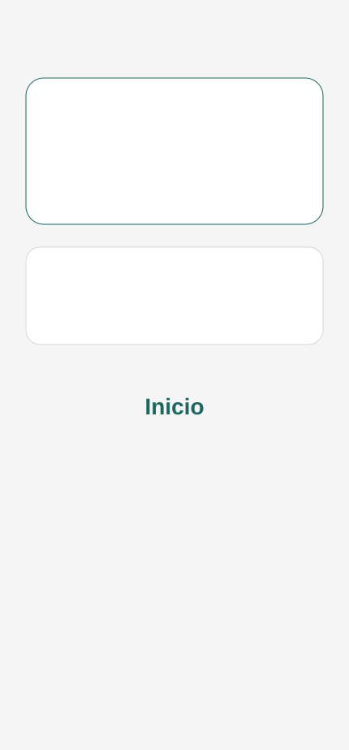 |
| Botiquín | 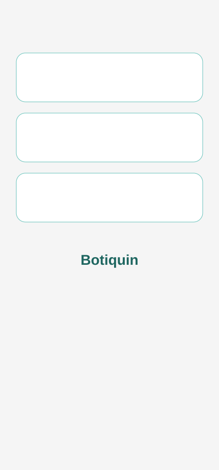 |
| Tratamientos | 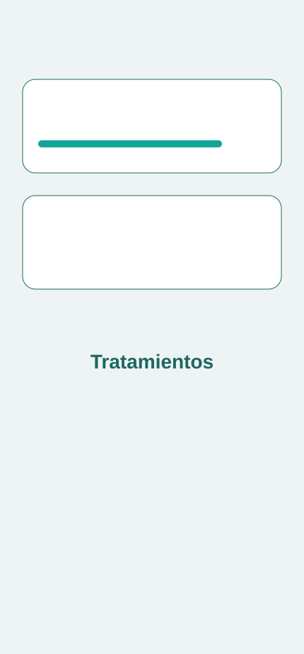 |
| Calendario | 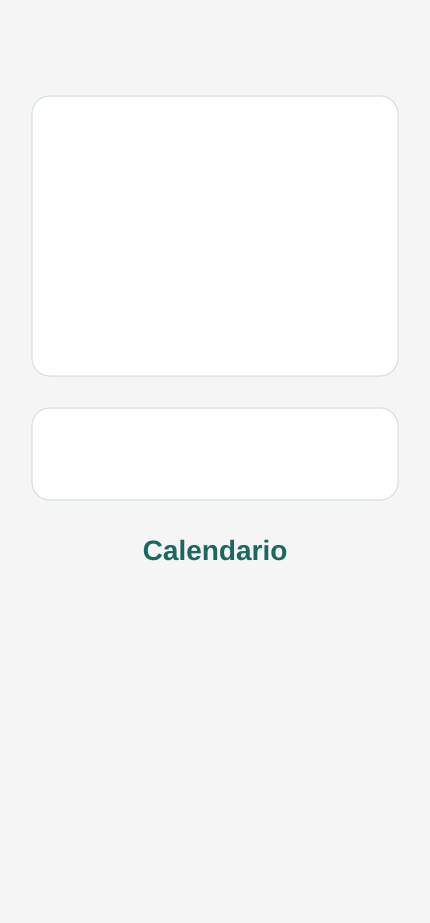 |
| Perfil | 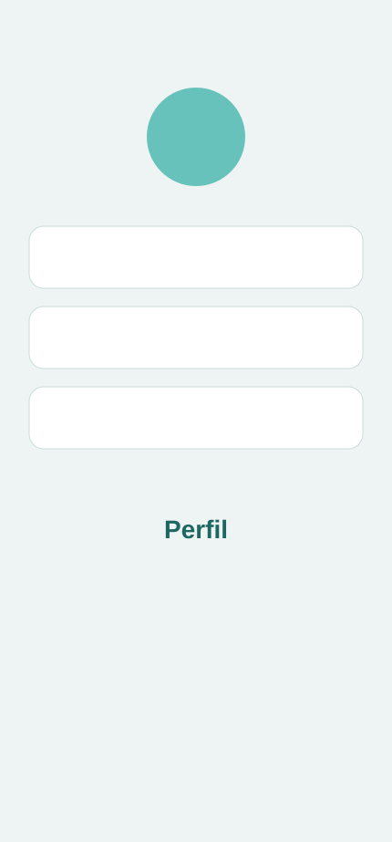 |
| Privacidad | 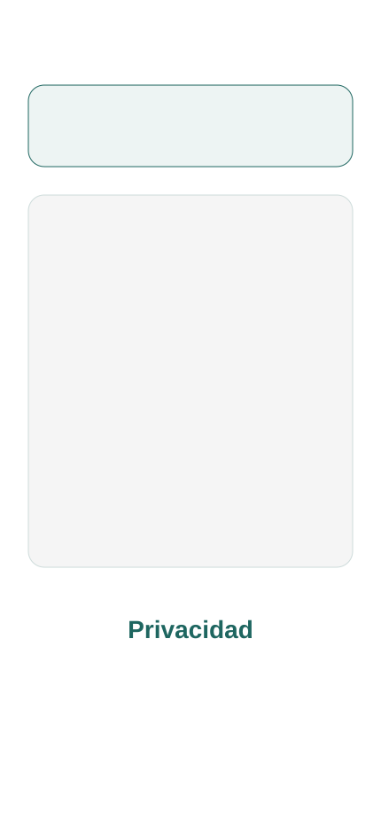 |

Las capturas recomendadas son móviles, con una anchura similar a la experiencia real de la PWA. En escritorio debe mostrarse el marco de dispositivo solo cuando se quiera evidenciar la adaptación desktop; para explicar flujos principales, la captura móvil directa resulta más clara.

## 9. Accesibilidad visual

La accesibilidad se integra en el diseño base porque Blíster trata información de salud que debe poder consultarse con claridad.

### 9.1 Contraste

El contraste se trabaja desde los tokens de texto, superficie y estados. Los colores semánticos no se utilizan como único mecanismo de comprensión; un estado de stock bajo, por ejemplo, debe estar acompañado por etiqueta o icono.

### 9.2 Áreas táctiles

Las acciones principales respetan un área táctil mínima de 44 px. Esta medida se aplica especialmente en navegación inferior, botones de formularios, menús contextuales y acciones de cards.

### 9.3 Iconografía y ARIA

La iconografía sirve para reconocimiento rápido, pero no sustituye a la accesibilidad textual. Las acciones solo con icono deben incorporar `aria-label` o texto alternativo equivalente.

| Criterio | Implementación |
| :--- | :--- |
| Contraste | Tokens semánticos preparados para cumplir contraste suficiente en claro y oscuro. |
| Área táctil | `--space-touch-min` de 44 px para acciones principales. |
| Labels | Formularios con etiquetas visibles y errores cercanos al campo. |
| ARIA | Uso de `aria-label`, `aria-live`, `aria-busy` y roles de diálogo cuando corresponde. |
| Personalización | Tema, tamaño de texto y fuente OpenDyslexic. |
| Color no exclusivo | Los estados se acompañan de texto, iconos o badges. |

Con esta guía, la interfaz mantiene coherencia visual y una base técnica escalable para seguir incorporando pantallas sin romper el sistema de diseño.
