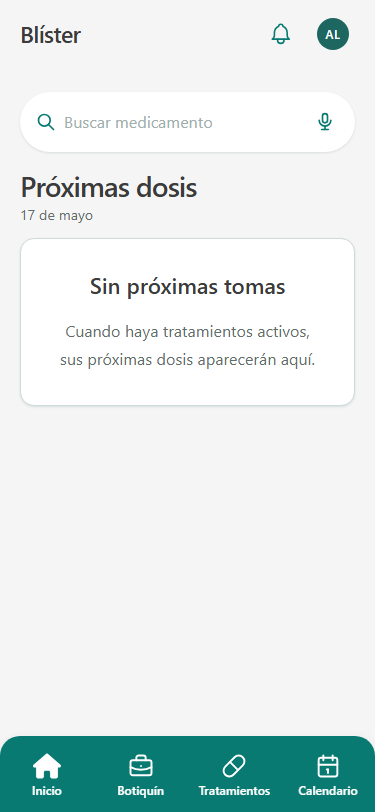
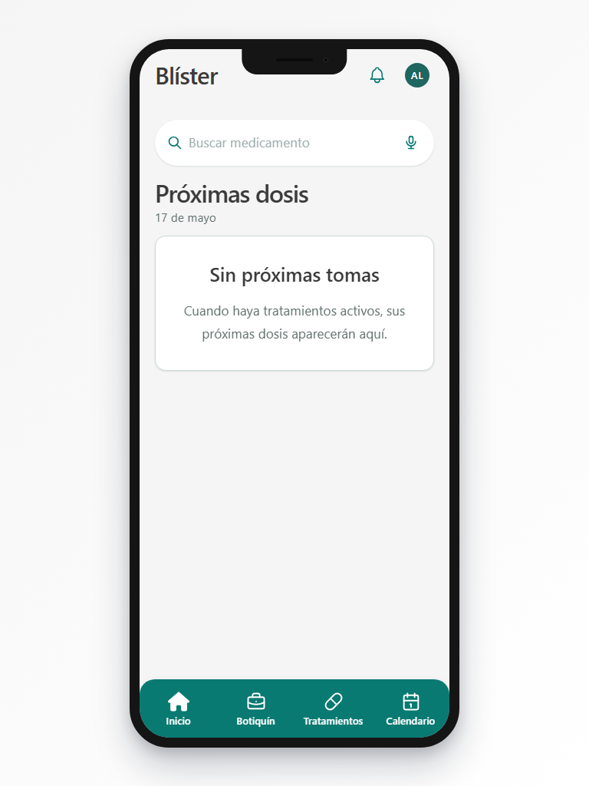
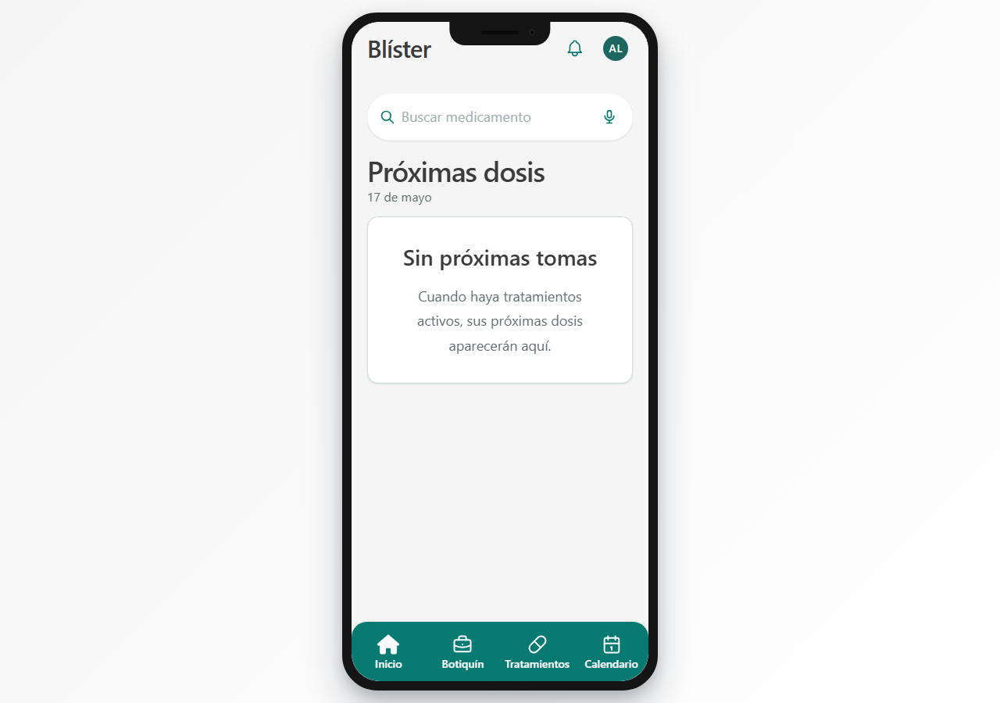

# 04 - Guía de estilos y prototipado

La guía de estilos define la identidad visual de Blíster y las reglas técnicas que permiten mantener una interfaz coherente. Este capítulo recoge el enlace al prototipo, la paleta, tipografía, espaciado, arquitectura CSS, componentes reutilizables, mockups iniciales y criterios de accesibilidad.

## Índice

1. [Prototipo](#1-prototipo)
	- 1.1 [Enlace y alcance](#11-enlace-y-alcance)
	- 1.2 [Relación con la implementación](#12-relación-con-la-implementación)
2. [Identidad visual](#2-identidad-visual)
	- 2.1 [Personalidad de marca](#21-personalidad-de-marca)
	- 2.2 [Uso del nombre y tono visual](#22-uso-del-nombre-y-tono-visual)
3. [Paleta cromática](#3-paleta-cromática)
	- 3.1 [Colores principales](#31-colores-principales)
	- 3.2 [Colores semánticos y de dominio](#32-colores-semánticos-y-de-dominio)
	- 3.3 [Tema oscuro](#33-tema-oscuro)
4. [Tipografía](#4-tipografía)
	- 4.1 [Familias tipográficas](#41-familias-tipográficas)
	- 4.2 [Escala de texto](#42-escala-de-texto)
	- 4.3 [Legibilidad y dislexia](#43-legibilidad-y-dislexia)
5. [Espaciado, bordes, radios y sombras](#5-espaciado-bordes-radios-y-sombras)
	- 5.1 [Espaciado](#51-espaciado)
	- 5.2 [Bordes y radios](#52-bordes-y-radios)
	- 5.3 [Sombras](#53-sombras)
6. [Arquitectura CSS](#6-arquitectura-css)
	- 6.1 [ITCSS](#61-itcss)
	- 6.2 [BEM](#62-bem)
	- 6.3 [Variables CSS](#63-variables-css)
7. [Componentes reutilizables](#7-componentes-reutilizables)
	- 7.1 [Botones y acciones](#71-botones-y-acciones)
	- 7.2 [Campos de formulario](#72-campos-de-formulario)
	- 7.3 [Cards y filas](#73-cards-y-filas)
	- 7.4 [Navegación y menús](#74-navegación-y-menús)
	- 7.5 [Estados de sistema](#75-estados-de-sistema)
8. [Mockups y capturas de pantallas principales](#8-mockups-y-capturas-de-pantallas-principales)
	- 8.1 [Origen de las capturas](#81-origen-de-las-capturas)
	- 8.2 [Pantallas del mockup inicial](#82-pantallas-del-mockup-inicial)
	- 8.3 [Evidencia responsive implementada](#83-evidencia-responsive-implementada)
9. [Accesibilidad visual](#9-accesibilidad-visual)
	- 9.1 [Contraste y uso del color](#91-contraste-y-uso-del-color)
	- 9.2 [Tipografía, lectura y personalización](#92-tipografía-lectura-y-personalización)
	- 9.3 [Áreas táctiles y navegación](#93-áreas-táctiles-y-navegación)
	- 9.4 [Formularios y mensajes de error](#94-formularios-y-mensajes-de-error)
	- 9.5 [Estados dinámicos y anuncios](#95-estados-dinámicos-y-anuncios)
	- 9.6 [Iconografía, foco y nombres accesibles](#96-iconografía-foco-y-nombres-accesibles)
	- 9.7 [Responsive y preferencias del usuario](#97-responsive-y-preferencias-del-usuario)

## 1. Prototipo

### 1.1 Enlace y alcance

El prototipo funcional de Blíster está disponible en Figma y sirve como referencia visual para las pantallas, jerarquías, flujo de entrada y experiencia mobile-first.

URL del prototipo:

```text
https://www.figma.com/proto/ij5gM2auQ6ZaJTTvSnkkZo/Bl%C3%ADster?node-id=97-133&t=eu3HSsCkrQK42KJW-1&scaling=scale-down&content-scaling=fixed&page-id=0%3A1&starting-point-node-id=97%3A133&show-proto-sidebar=1
```

El enlace corresponde a la navegación pública del prototipo y permite comprobar el recorrido inicial previsto para la aplicación. La guía visual se completa con capturas del mockup inicial, tokens de estilo, componentes implementados y criterios de accesibilidad.

### 1.2 Relación con la implementación

La implementación actual no depende de componentes exportados desde Figma. La fuente de verdad de la interfaz está en los componentes React y en los tokens SCSS del proyecto.

El prototipo actúa como referencia de intención visual: jerarquía, tono, densidad, composición mobile-first y estilo de superficies. La aplicación implementada ha evolucionado sobre esa base para incorporar estados reales, permisos, formularios, validaciones, notificaciones, privacidad y escritorio con marco móvil.

## 2. Identidad visual

### 2.1 Personalidad de marca

Blíster se presenta como una herramienta sanitaria doméstica: clara, cercana y fiable. La identidad evita una estética clínica fría y prioriza que el usuario pueda leer rápido qué medicamento tiene, cuándo debe tomarlo y qué acción puede realizar.

| Atributo | Traducción visual |
| :--- | :--- |
| Cuidado | Interfaz amable, lenguaje directo y componentes con aire suficiente. |
| Rigor | Datos oficiales CIMA, estados claros y alertas diferenciadas. |
| Calma | Paleta verde, superficies limpias y uso contenido del color de advertencia. |
| Seguridad | Confirmaciones, mensajes de error visibles y acciones destructivas diferenciadas. |

La personalidad se apoya en una idea principal: la aplicación debe acompañar sin dramatizar. El dominio de salud exige rigor, pero el contexto de uso es doméstico; por eso la interfaz evita una imagen hospitalaria rígida y busca un equilibrio entre confianza, serenidad y acción inmediata.

### 2.2 Uso del nombre y tono visual

El nombre se escribe como **Blíster** cuando se refiere al producto. En el código aparecen nombres técnicos sin tilde cuando una ruta, variable o archivo lo requiere.

El tono visual prioriza textos cortos, titulares claros y etiquetas funcionales. Las pantallas no introducen explicaciones decorativas dentro de la interfaz; cuando una acción necesita contexto, se utiliza ayuda puntual, feedback inline o una confirmación. Esta decisión reduce ruido en móvil y mantiene el foco en la tarea sanitaria.

## 3. Paleta cromática

Los colores se definen en `frontend/src/scss/00-settings/_colors.scss` mediante variables CSS. Los componentes consumen tokens, no valores hexadecimales sueltos.


### 3.1 Colores principales

| Token | Valor | Uso |
| :--- | :--- | :--- |
| `--color-primary` | `#1e6660` | Botones principales, enlaces activos y acciones relevantes. |
| `--color-primary-mid` | `#087a72` | Indicadores, barras de progreso y fondos interactivos con contraste AA. |
| `--color-primary-subtle` | `#67c2bb` | Avatares, chips suaves y acentos secundarios. |
| `--color-accent` | `#d97757` | Terracota para palabras destacadas y avisos no críticos. |
| `--color-bg` | `#f5f5f5` | Fondo general claro. |
| `--color-surface` | `#ffffff` | Formularios, cards y superficies. |

### 3.2 Colores semánticos y de dominio

| Token | Significado |
| :--- | :--- |
| `--color-success` | Estado correcto o acción completada. |
| `--color-warning` | Atención necesaria, como stock bajo. |
| `--color-error` | Error, stock crítico o caducidad vencida. |
| `--color-info` | Información neutral, especialmente citas. |
| `--color-dose-taken` | Toma registrada. |
| `--color-dose-pending` | Toma pendiente. |
| `--color-stock-ok` | Stock suficiente. |
| `--color-stock-low` | Stock bajo. |
| `--color-stock-critical` | Stock agotado o crítico. |
| `--color-expired` | Medicamento caducado. |

### 3.3 Tema oscuro

El tema oscuro se activa con `data-theme="dark"` en el elemento `html`. Los componentes no consultan directamente `prefers-color-scheme`; consumen los mismos tokens con valores redefinidos para mantener coherencia.

## 4. Tipografía

La tipografía se define en `frontend/src/scss/00-settings/_typography.scss`. La combinación busca legibilidad en móvil y personalidad en pantallas de marca.


### 4.1 Familias tipográficas

| Token | Familia | Uso |
| :--- | :--- | :--- |
| `--font-display` | Overpass | H1, onboarding y títulos de alto impacto. |
| `--font-body` | Nunito | Texto general, formularios, navegación y cards. |
| `--font-dyslexia` | OpenDyslexic | Modo de lectura accesible. |

Overpass se reserva para momentos de identidad y jerarquía fuerte. Nunito sostiene la aplicación diaria porque resulta amable en tamaños pequeños. OpenDyslexic se ofrece como opción de accesibilidad, no como tipografía por defecto, para que cada usuario pueda decidir si mejora su lectura.

### 4.2 Escala de texto

La escala usa tokens como `--text-xs`, `--text-sm`, `--text-base`, `--text-lg`, `--text-xl`, `--text-2xl` y superiores. El tamaño base puede modificarse con `data-text-size="large"` o `data-text-size="xlarge"`.

La escala evita que cada componente decida tamaños aislados. En cards, formularios y navegación se usan tamaños intermedios para que el contenido entre en pantallas móviles sin perder legibilidad. Los tamaños mayores se reservan para onboarding, títulos de página y mensajes de estado.

### 4.3 Legibilidad y dislexia

La legibilidad se refuerza con altura de línea suficiente, pesos moderados y contraste entre texto principal, texto secundario y estados. El selector de fuente disléxica cambia la familia sin modificar la estructura del layout, por lo que la interfaz conserva espaciados y áreas táctiles.

Los mensajes de error se muestran junto al campo afectado y en español, evitando que la persona tenga que interpretar códigos técnicos o mensajes en inglés.

## 5. Espaciado, bordes, radios y sombras

El sistema visual centraliza medidas para reducir inconsistencias entre pantallas.

### 5.1 Espaciado


| Token | Equivalencia | Uso |
| :--- | :--- | :--- |
| `--space-1` | 0.25rem | Separación mínima. |
| `--space-2` | 0.5rem | Elementos compactos. |
| `--space-4` | 1rem | Separación estándar. |
| `--space-6` | 1.5rem | Bloques internos. |
| `--space-8` | 2rem | Separación entre secciones. |
| `--space-touch-min` | 2.75rem | Área táctil mínima de 44 px. |
| `--space-bottom-nav-height` | 4.75rem | Altura de navegación inferior. |

### 5.2 Bordes y radios


| Token | Uso |
| :--- | :--- |
| `--radius-sm` | Inputs, badges y tooltips. |
| `--radius-md` | Cards y paneles estándar. |
| `--radius-lg` | Cards de medicamento y bottom sheets. |
| `--radius-xl` | Modales o superficies amplias. |
| `--radius-full` | Avatares, chips, toggles y botones circulares. |

### 5.3 Sombras


| Token | Uso |
| :--- | :--- |
| `--shadow-sm` | Separación sutil en listas. |
| `--shadow-md` | Dropdowns, modales y bottom sheets. |
| `--shadow-lg` | Toasts y superficies de máxima prioridad. |
| `--shadow-card-soft` | Cards principales. |
| `--shadow-device` | Marco de dispositivo móvil en escritorio. |

## 6. Arquitectura CSS

La arquitectura de estilos sigue ITCSS y BEM. La entrada global es `frontend/src/scss/main.scss` y las capas se importan de menor a mayor especificidad.

```scss
@use '00-settings' as settings;
@use '01-tools' as tools;
@use '02-generic' as generic;
@use '03-elements' as elements;
@use '04-objects' as objects;
@use '05-components' as components;
@use '06-utilities' as utilities;
```

### 6.1 ITCSS

| Capa | Responsabilidad |
| :--- | :--- |
| `00-settings` | Tokens y variables globales. |
| `01-tools` | Mixins y funciones SCSS. |
| `02-generic` | Reset y normalización. |
| `03-elements` | Estilos base de etiquetas HTML. |
| `04-objects` | Patrones de layout sin apariencia de marca. |
| `05-components` | Componentes concretos de interfaz. |
| `06-utilities` | Utilidades controladas. |

La ventaja de ITCSS en este proyecto es que permite escalar pantallas nuevas sin aumentar la especificidad de forma desordenada. Los tokens y herramientas aparecen primero; los componentes concretos llegan después; y las utilidades quedan al final para ajustes pequeños y explícitos.

### 6.2 BEM

La nomenclatura BEM utiliza prefijos: `.c-` para componentes, `.o-` para objetos de layout y `.u-` para utilidades.

Ejemplos reales de la aplicación:

| Prefijo | Ejemplo | Significado |
| :--- | :--- | :--- |
| `.c-` | `.c-appointment-card` | Componente con aspecto propio. |
| `.o-` | `.o-stack` | Objeto de layout reutilizable. |
| `.u-` | `.u-sr-only` | Utilidad puntual de accesibilidad. |

BEM ayuda a localizar responsabilidades: una clase de componente no debería utilizarse para resolver un problema global, y una utilidad no debería convertirse en una variante visual compleja.

### 6.3 Variables CSS

Los tokens se exponen como variables CSS para poder cambiar tema, tamaño de texto y familias tipográficas sin recompilar Sass. Esta decisión permite que preferencias como `data-theme`, `data-font` o `data-text-size` se apliquen en tiempo de ejecución.

La regla general es que los componentes consuman variables semánticas, no valores literales. Así, un botón usa `--color-primary` o `--color-error` según intención, en lugar de repetir un hexadecimal.

## 7. Componentes reutilizables

La tabla recoge componentes reales del proyecto React. No describe componentes de Figma, sino piezas implementadas en `frontend/src/components`.

Los componentes se agrupan por responsabilidad: átomos para controles básicos, moléculas para combinaciones pequeñas, organismos para bloques funcionales y layouts para estructura de página.

| Componente | Ubicación | Uso principal |
| :--- | :--- | :--- |
| `Button` | `atoms` | Botones primarios, secundarios, ghost y destructivos. |
| `Input` | `atoms` | Campos con label, ayuda y error inline. |
| `Modal` | `atoms` | Diálogos de confirmación y edición. |
| `Avatar` | `atoms` | Identidad visual de usuario o blíster. |
| `Skeleton` | `atoms` | Estados de carga. |
| `EmptyState` | `atoms` | Pantallas sin datos con acción sugerida. |
| `ErrorState` | `atoms` | Fallos recuperables con reintento. |
| `Stepper` | `atoms` | Progreso en flujos guiados. |
| `InfoTooltip` | `atoms` | Información auxiliar accesible. |
| `SearchBar` | `molecules` | Búsqueda de listados. |
| `CimaSearchDropdown` | `molecules` | Resultados de medicamentos oficiales. |
| `StockBadge` | `molecules` | Estado visual de stock. |
| `RoleBadge` | `molecules` | Identificación de OWNER, CAREGIVER y OBSERVER. |
| `ActionMenuButton` | `molecules` | Menús contextuales en cards. |
| `ForceDoseDialog` | `molecules` | Confirmación de toma con stock insuficiente. |
| `UndoToast` | `molecules` | Acción reversible tras registrar una toma. |
| `ThemeSelector`, `FontSelector`, `TextSizeSelector` | `molecules` | Ajustes de accesibilidad. |
| `AppHeader` | `organisms` | Cabecera privada con perfil y notificaciones. |
| `BottomNav` | `organisms` | Navegación inferior móvil. |
| `NotificationsSheet` | `organisms` | Panel de notificaciones. |
| `MedicineCard` | `organisms` | Card de inventario. |
| `AppointmentCard` | `organisms` | Card de cita con comentarios y acciones. |
| `TreatmentRow` | `organisms` | Fila de tratamiento. |
| `BlisterSelector` y variantes | `organisms` | Cambio de contexto de blíster. |
| `AppLayout` | `layout` | Shell privado con cabecera y navegación. |
| `AuthLayout` | `layout` | Estructura de pantallas de acceso. |
| `PublicPageLayout` | `layout` | Páginas públicas como privacidad. |
| `DesktopDeviceShell` | `layout` | Marco móvil en escritorio y pantalla de entrada. |

### 7.1 Botones y acciones

Los botones diferencian prioridad visual: acción primaria, acción secundaria, acción fantasma y acción destructiva. Las acciones críticas, como eliminar o revocar, no dependen solo del color; se acompañan de texto claro y confirmación cuando procede.

### 7.2 Campos de formulario

Los campos muestran label visible, ayuda opcional y error inline. Esta estructura es importante porque Blíster maneja formularios con datos sensibles: cuenta, contraseña, medicamentos, tratamientos, citas, preferencias y tokens MCP.

### 7.3 Cards y filas

Las cards se usan para elementos repetidos que el usuario revisa con frecuencia: medicamentos, citas, tratamientos o blísteres. Las filas se reservan para listados más densos. En ambos casos se mantiene una jerarquía estable: título, metadatos, estado y acciones.

### 7.4 Navegación y menús

La navegación inferior concentra las secciones principales de la aplicación privada. Los menús contextuales aparecen en cards y deben abrirse sin tapar la acción principal ni quedar fuera del viewport móvil.

### 7.5 Estados de sistema

Los estados `Skeleton`, `EmptyState`, `ErrorState`, toasts y diálogos comunican qué está ocurriendo. La interfaz evita silencios: cuando se carga, falla, queda vacía o se completa una acción, debe existir una respuesta visible.

## 8. Mockups y capturas de pantallas principales

Las capturas aportadas en este apartado corresponden al mockup inicial creado en Figma. Documentan la fase de prototipado visual, la composición mobile-first y los flujos principales previstos al comienzo del diseño.

### 8.1 Origen de las capturas

El mockup de Figma representa la intención visual inicial de Blíster: una aplicación móvil clara, con cards de lectura rápida, navegación inferior, colores sanitarios suaves y jerarquía centrada en medicamentos, tratamientos y citas.

Estas capturas no se corresponden 1:1 con el diseño final implementado. Durante el desarrollo se incorporaron nuevas necesidades funcionales y de accesibilidad, como estados reales de carga y error, validación de formularios, permisos por rol, política de privacidad, configuración MCP, ajustes de accesibilidad, notificaciones y adaptación de escritorio mediante marco móvil. Por tanto, las imágenes sirven como evidencia del prototipado inicial y no como especificación exacta de la interfaz final.

### 8.2 Pantallas del mockup inicial

| Pantalla | Captura del mockup |
| :--- | :--- |
| Onboarding |  |
| Inicio |  |
| Botiquín |  |
| Tratamientos |  |
| Calendario |  |
| Perfil |  |

La evolución entre mockup e implementación se considera parte natural del proceso de desarrollo. El prototipo permitió definir lenguaje visual, estructura móvil y prioridades de contenido; la aplicación final ajustó esa base a restricciones reales de datos, validaciones, permisos, estados de sistema y despliegue.

### 8.3 Evidencia responsive implementada

Además del mockup inicial, se generaron capturas automáticas con Playwright sobre la aplicación construida y autenticada. La prueba valida que no exista overflow horizontal y guarda la home en tres anchos representativos.

| Viewport | Captura generada |
| :--- | :--- |
| Mobile 375 x 812 |  |
| Tablet 768 x 1024 |  |
| Desktop 1280 x 900 |  |

## 9. Accesibilidad visual

La accesibilidad se integra en el diseño base porque Blíster trata información de salud que debe poder consultarse con claridad.

### 9.1 Contraste y uso del color

El contraste se trabaja desde los tokens de texto, superficie y estados. La interfaz distingue texto principal, texto secundario, fondos, bordes, avisos y acciones para que la información importante no dependa de matices difíciles de percibir.

Los colores semánticos no se utilizan como único mecanismo de comprensión. Un estado de stock bajo, una caducidad próxima o una toma registrada se acompañan de texto, badge, icono o estructura visual. De este modo, el usuario puede interpretar el estado aunque tenga daltonismo, bajo contraste ambiental o pantalla con brillo reducido.

La revisión final corrigió contrastes detectados por axe en botones primarios, navegación inferior, avatares con iniciales, textos secundarios y selectores de accesibilidad. La validación automática cubre la entrada pública y tres pantallas privadas: home, formulario de cita y ajustes de accesibilidad.

| Elemento | Criterio aplicado |
| :--- | :--- |
| Texto principal | Contraste alto sobre superficies claras u oscuras. |
| Texto secundario | Menor peso visual sin perder legibilidad. |
| Estados de error | Color semántico, mensaje textual y ubicación cercana al problema. |
| Stock y caducidad | Badge o etiqueta además del color. |
| Acciones destructivas | Color diferenciado y texto explícito. |

### 9.2 Tipografía, lectura y personalización

La tipografía base se elige por legibilidad en móvil. Nunito se utiliza para lectura diaria y Overpass se reserva para títulos de mayor presencia. El sistema evita bloques densos de texto en cards y prioriza etiquetas breves, jerarquía clara y separación visual entre datos.

Blíster incorpora ajustes de accesibilidad vinculados al usuario: tema claro, oscuro o sistema; tamaño de texto normal, grande o extra grande; y fuente OpenDyslexic. Estos ajustes permiten adaptar la experiencia a diferentes necesidades visuales sin cambiar el contenido funcional.

| Preferencia | Efecto en la interfaz |
| :--- | :--- |
| Tema claro | Fondos claros y contraste suave para uso habitual. |
| Tema oscuro | Reducción de brillo y superficies oscuras. |
| Tamaño grande | Mayor legibilidad en navegación, formularios y cards. |
| OpenDyslexic | Alternativa tipográfica para usuarios con dislexia. |

La escala tipográfica evita depender de tamaño de viewport para textos críticos. El contenido debe mantener legibilidad en móviles estrechos y en el marco de escritorio.

### 9.3 Áreas táctiles y navegación

Las acciones principales respetan un área táctil mínima de 44 px. Esta medida se aplica especialmente en navegación inferior, botones de formularios, menús contextuales y acciones de cards.

La navegación se organiza alrededor de zonas previsibles: cabecera, contenido principal y navegación inferior. En móvil, las acciones frecuentes quedan cerca del pulgar; en escritorio, el marco móvil mantiene la misma disposición para no crear dos experiencias divergentes.

| Zona | Criterio de accesibilidad |
| :--- | :--- |
| Navegación inferior | Icono y texto, área táctil estable y estado activo claro. |
| Cabecera | Acciones agrupadas y nombres accesibles en iconos. |
| Cards | Acción principal visible y menú contextual separado. |
| Formularios | Botones con tamaño suficiente y separación entre controles. |
| Modales | Foco visual y acciones de confirmación/cancelación diferenciadas. |

### 9.4 Formularios y mensajes de error

Los formularios son un punto crítico porque recogen datos de cuenta, medicamentos, tratamientos, citas y preferencias. Cada campo debe presentar una etiqueta visible, un valor comprensible, estado de error cercano y un mensaje en español.

Los errores no se limitan a bloquear el envío. Indican qué dato debe corregirse y aparecen junto al input correspondiente. Esta decisión evita que el usuario tenga que deducir el problema a partir de un mensaje genérico situado lejos del campo.

| Patrón | Aplicación |
| :--- | :--- |
| Label visible | Identifica el dato antes de interactuar. |
| Ayuda contextual | Aclara formatos como hora, contraseña o unidad. |
| Error inline | Sitúa el problema junto al campo afectado. |
| Mensajes en español | Reduce fricción para usuarios en España. |
| Confirmaciones | Protegen acciones irreversibles o sensibles. |

### 9.5 Estados dinámicos y anuncios

La aplicación utiliza estados de carga, vacío, error y éxito para que el usuario entienda qué ocurre después de cada acción. Esta respuesta es especialmente importante en operaciones asíncronas, como buscar en CIMA, guardar un tratamiento, registrar una toma o activar notificaciones push.

Los estados dinámicos se apoyan en componentes como `Skeleton`, `EmptyState`, `ErrorState`, toasts, diálogos y hojas de notificaciones. Cuando el cambio afecta al contexto inmediato, el mensaje aparece cerca de la acción; cuando es un evento global, se comunica mediante toast o bandeja.

| Estado | Respuesta de interfaz |
| :--- | :--- |
| Carga | Skeleton o indicador contextual. |
| Sin datos | Estado vacío con acción principal si procede. |
| Error recuperable | Mensaje claro y opción de reintento. |
| Acción completada | Toast o actualización inmediata del contenido. |
| Acción reversible | Toast con opción de deshacer cuando existe ventana de reversión. |

### 9.6 Iconografía, foco y nombres accesibles

La iconografía sirve para reconocimiento rápido, pero no sustituye a la accesibilidad textual. Las acciones solo con icono incorporan nombre accesible mediante texto asociado o `aria-label`, especialmente en menús, botones de cierre, acciones de notificación y controles de navegación.

El foco visible es necesario para navegación con teclado y tecnologías de asistencia. Los controles interactivos deben mantener estados diferenciables de foco, hover, activo y deshabilitado. En diálogos y modales, el usuario debe reconocer qué acción confirma, cuál cancela y cuál cierra la superficie.

| Elemento | Criterio |
| :--- | :--- |
| Botón con icono | Nombre accesible y propósito único. |
| Menú contextual | Apertura controlada y opciones etiquetadas. |
| Modal | Rol de diálogo y foco dirigido a la acción adecuada. |
| Toast | Mensaje breve y acción reversible si corresponde. |
| Campo inválido | Relación entre input y mensaje de error. |

### 9.7 Responsive y preferencias del usuario

El diseño es mobile-first porque la consulta y registro de medicación suelen realizarse desde el teléfono. En escritorio, `DesktopDeviceShell` conserva el marco móvil para mantener una experiencia coherente y evitar que la interfaz sanitaria se disperse en anchos excesivos.

Las preferencias visuales se aplican desde atributos globales y tokens CSS. Este enfoque permite cambiar tema, tamaño y fuente sin duplicar componentes ni crear variantes paralelas de cada pantalla.

Resumen de criterios aplicados:

| Criterio | Implementación |
| :--- | :--- |
| Contraste | Tokens semánticos preparados para cumplir contraste suficiente en claro y oscuro. |
| Área táctil | `--space-touch-min` de 44 px para acciones principales. |
| Labels | Formularios con etiquetas visibles y errores cercanos al campo. |
| ARIA | Uso de `aria-label`, `aria-live`, `aria-busy` y roles de diálogo cuando corresponde. |
| Personalización | Tema, tamaño de texto y fuente OpenDyslexic. |
| Color no exclusivo | Los estados se acompañan de texto, iconos o badges. |
| Foco visible | Controles interactivos diferenciables al navegar con teclado. |
| Estados de sistema | Carga, vacío, error y éxito representados con componentes específicos. |
| Estructura mobile-first | Navegación inferior, cabecera estable y contenido jerarquizado. |
| Responsive | Capturas Playwright en 375, 768 y 1280 px, sin overflow horizontal. |
| WCAG automático | Axe WCAG A/AA sin violaciones serias o críticas en pantallas privadas verificadas. |

Con esta guía, la interfaz mantiene coherencia visual, lectura clara y una base accesible para gestionar información sanitaria en un contexto doméstico.
