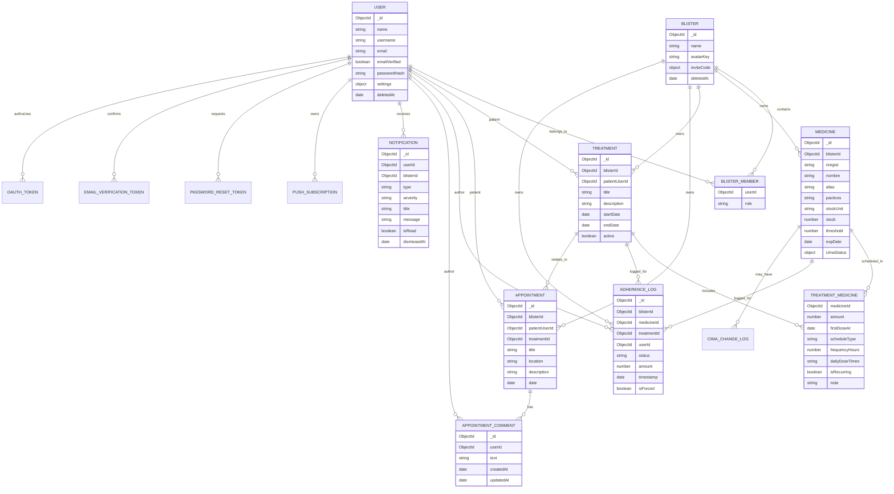
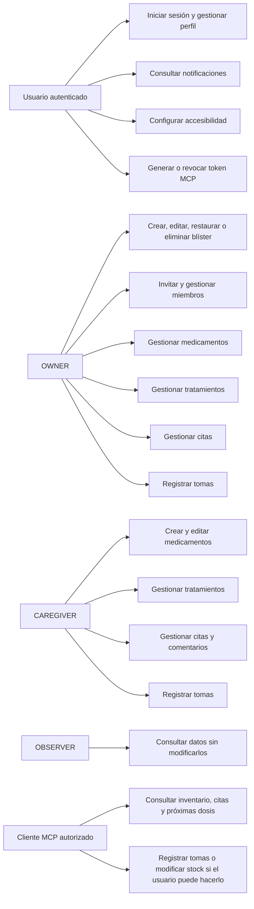
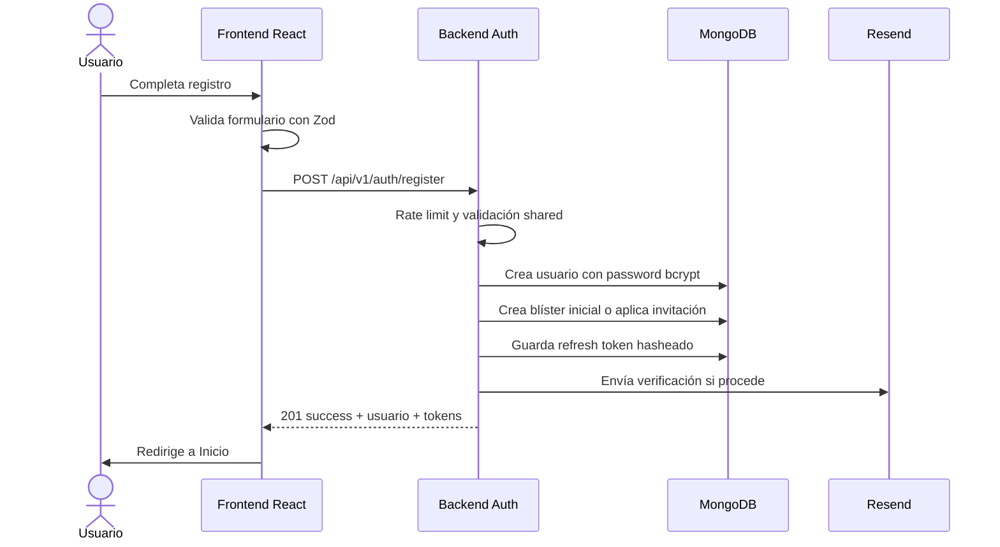
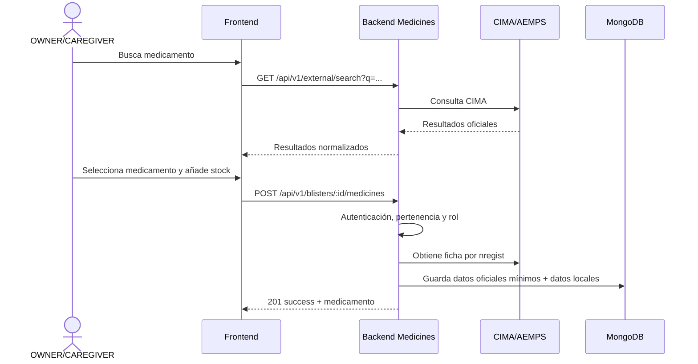
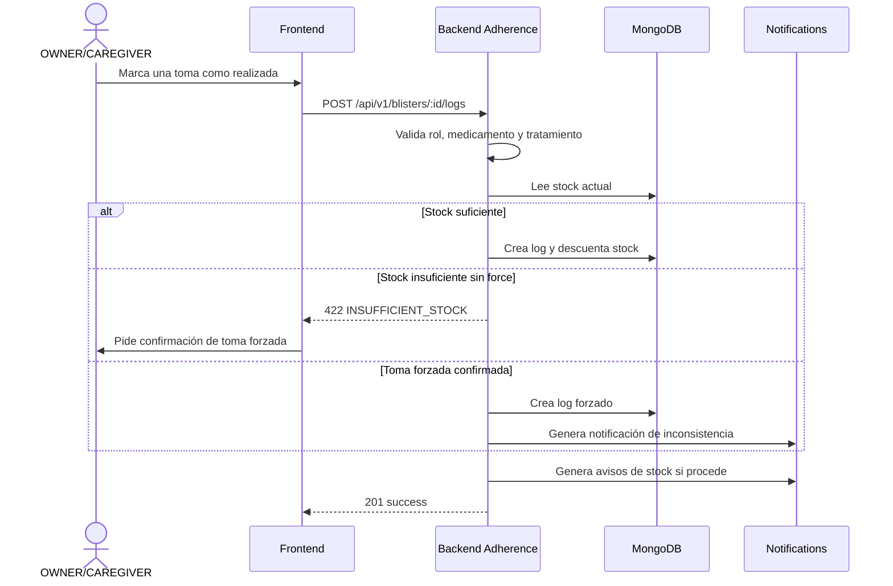
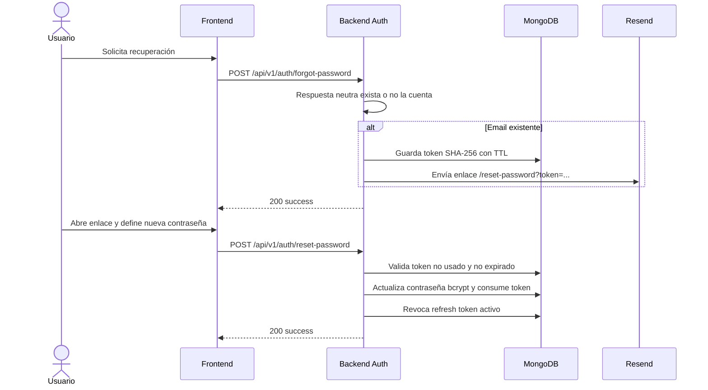
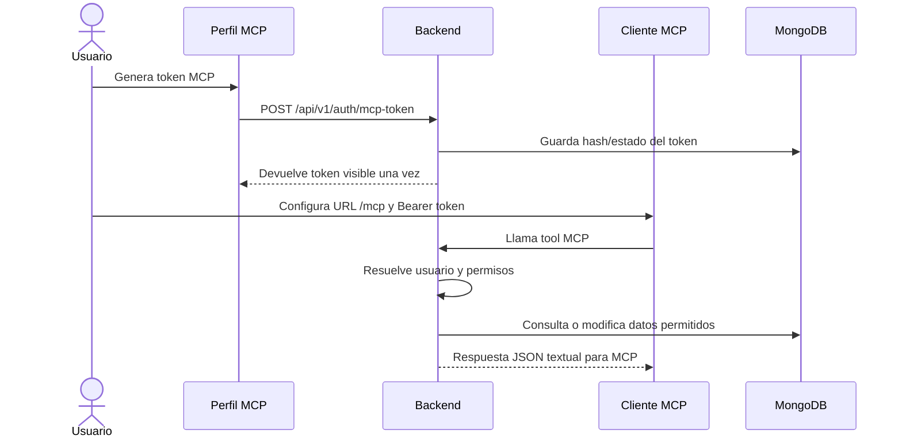
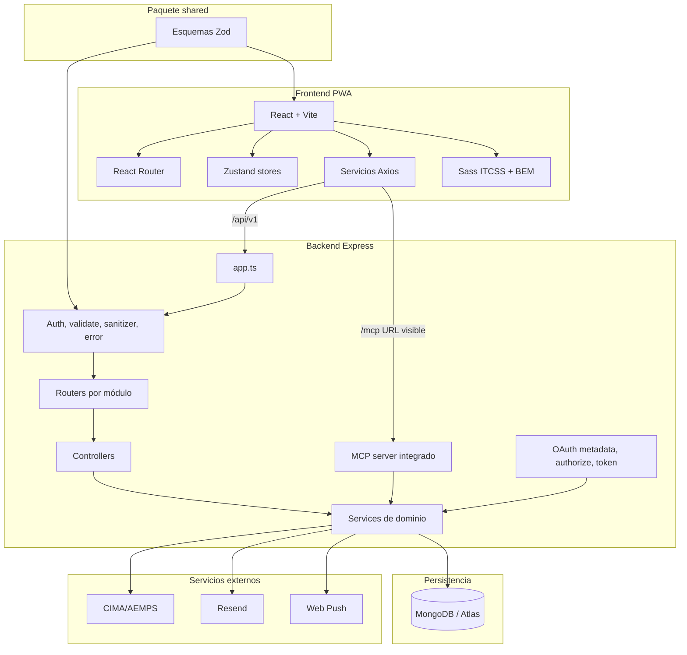

# 05 - Diseño de la solución

Este capítulo describe el diseño técnico de Blíster: modelo de datos, casos de uso, flujos de proceso, arquitectura de aplicación y diseño de la API. La experiencia visual queda documentada en la guía de estilos; aquí se recoge la estructura que permite que el sistema funcione de forma segura y mantenible.

## Índice

1. [Modelo de datos](#1-modelo-de-datos)
2. [Diagrama entidad-relación](#2-diagrama-entidad-relación)
3. [Casos de uso](#3-casos-de-uso)
4. [Flujos de procesos principales](#4-flujos-de-procesos-principales)
    - 4.1 [Registro y creación de blíster inicial](#41-registro-y-creación-de-blíster-inicial)
    - 4.2 [Alta de medicamento desde CIMA](#42-alta-de-medicamento-desde-cima)
    - 4.3 [Registro de toma y control de stock](#43-registro-de-toma-y-control-de-stock)
    - 4.4 [Recuperación de contraseña](#44-recuperación-de-contraseña)
    - 4.5 [Acceso MCP](#45-acceso-mcp)
5. [Arquitectura de la aplicación](#5-arquitectura-de-la-aplicación)
    - 5.1 [Capas del backend](#51-capas-del-backend)
    - 5.2 [Capas del frontend](#52-capas-del-frontend)
6. [Diseño de la API REST](#6-diseño-de-la-api-rest)
    - 6.1 [Auth y perfil](#61-auth-y-perfil)
    - 6.2 [Blísteres y miembros](#62-blísteres-y-miembros)
    - 6.3 [Medicamentos](#63-medicamentos)
    - 6.4 [Tratamientos](#64-tratamientos)
    - 6.5 [Adherencia](#65-adherencia)
    - 6.6 [Citas](#66-citas)
    - 6.7 [Vistas agregadas, CIMA y notificaciones](#67-vistas-agregadas-cima-y-notificaciones)
7. [Diseño del endpoint MCP y OAuth](#7-diseño-del-endpoint-mcp-y-oauth)
8. [Convenciones de respuesta y errores](#8-convenciones-de-respuesta-y-errores)
9. [Decisiones de diseño técnico](#9-decisiones-de-diseño-técnico)

## 1. Modelo de datos

Blíster usa MongoDB con Mongoose. Aunque la base de datos es documental, el dominio tiene relaciones claras entre usuarios, blísteres, medicamentos, tratamientos, citas, logs, notificaciones y tokens. La clave de aislamiento multiusuario es `blisterId`.

| Colección | Descripción | Relaciones principales |
| :--- | :--- | :--- |
| `users` | Identidad, credenciales, preferencias, sesión, email y MCP clásico. | Miembro de blísteres, autor de logs y comentarios, receptor de notificaciones. |
| `blisters` | Espacio sanitario compartido con miembros, roles, invitación y borrado lógico. | Contiene medicamentos, tratamientos, citas y logs. |
| `medicines` | Medicamento local vinculado a CIMA por `nregist`. | Pertenece a un blíster y puede formar parte de tratamientos y logs. |
| `treatments` | Pauta médica con paciente, fechas y medicamentos asociados. | Pertenece a un blíster, referencia usuario paciente y medicamentos. |
| `adherenceLogs` | Registro de toma u omisión con autoría, cantidad, estado y toma forzada. | Referencia blíster, medicamento, tratamiento y usuario autor. |
| `appointments` | Citas médicas con paciente, fecha, tratamiento opcional y comentarios. | Referencia blíster, paciente, tratamiento y autores de comentarios. |
| `notifications` | Bandeja de avisos del usuario. | Referencia usuario receptor y opcionalmente blíster. |
| `pushSubscriptions` | Suscripciones Web Push por navegador. | Referencia usuario. |
| `passwordResetTokens` | Tokens de recuperación hasheados con TTL. | Referencia usuario. |
| `emailVerificationTokens` | Tokens de verificación de correo hasheados con TTL. | Referencia usuario y email. |
| `oauthTokens` | Refresh tokens OAuth con expiración. | Referencia usuario y cliente externo. |
| `cimaChangeLogs` | Cambios detectados en información oficial CIMA. | Referencia medicamento opcional y `nregist`. |
| `systemMetas` | Estado de procesos internos. | Clave-valor para sincronizaciones o tareas. |

## 2. Diagrama entidad-relación

El siguiente diagrama resume las relaciones principales. Se representa en formato ER para facilitar la lectura, aunque la persistencia real se realiza en documentos MongoDB.



## 3. Casos de uso

Los casos de uso se agrupan por actor. La autorización final depende siempre del rol dentro del blíster.



## 4. Flujos de procesos principales

Los flujos representan procesos de negocio que cruzan frontend, backend y base de datos.

### 4.1 Registro y creación de blíster inicial



### 4.2 Alta de medicamento desde CIMA



### 4.3 Registro de toma y control de stock



### 4.4 Recuperación de contraseña



### 4.5 Acceso MCP



## 5. Arquitectura de la aplicación

La arquitectura separa presentación, API, dominio, persistencia, contratos compartidos e integraciones externas.



### 5.1 Capas del backend

| Capa | Responsabilidad |
| :--- | :--- |
| Router | Define rutas, middlewares y validaciones. |
| Controller | Traduce la petición HTTP a llamada de servicio. |
| Service | Aplica reglas de negocio, permisos de dominio e integraciones. |
| Model | Define persistencia Mongoose e índices. |
| Middleware | Autenticación, autorización, validación, sanitización y errores. |

### 5.2 Capas del frontend

| Capa | Responsabilidad |
| :--- | :--- |
| Pages | Pantallas conectadas a rutas. |
| Components | Atoms, molecules, organisms y layouts reutilizables. |
| Services | Cliente HTTP y llamadas por dominio. |
| Stores | Sesión, contexto de blíster y estados de interfaz. |
| SCSS | Sistema visual global con tokens y BEM. |

## 6. Diseño de la API REST

La API se versiona bajo `/api/v1`. Todas las rutas privadas usan Bearer JWT salvo las rutas públicas de autenticación, recuperación y metadatos OAuth.

La documentación OpenAPI se publica en `/api/v1/docs` y se genera desde comentarios JSDoc de rutas y aplicación. La revisión final amplió Swagger para cubrir los endpoints actuales de autenticación, recuperación, confirmación de email, logout, borrado de cuenta, notificaciones push, OAuth, descubrimiento well-known y transporte MCP. Las operaciones críticas incluyen ejemplos de request, respuesta correcta y error para que la API pueda probarse desde Swagger UI sin consultar el código.

### 6.1 Auth y perfil

| Método | Endpoint | Auth | Respuesta principal |
| :--- | :--- | :---: | :--- |
| `POST` | `/api/v1/auth/register` | No | `201` usuario y tokens. |
| `POST` | `/api/v1/auth/login` | No | `200` usuario y tokens. |
| `POST` | `/api/v1/auth/refresh` | No | `200` tokens rotados. |
| `POST` | `/api/v1/auth/logout` | Sí | `200` sesión cerrada. |
| `POST` | `/api/v1/auth/forgot-password` | No | `200` respuesta neutra. |
| `POST` | `/api/v1/auth/reset-password` | No | `200` contraseña actualizada. |
| `POST` | `/api/v1/auth/confirm-email` | No | `200` email confirmado. |
| `PATCH` | `/api/v1/auth/profile` | Sí | `200` perfil actualizado. |
| `DELETE` | `/api/v1/auth/account` | Sí | `200` cuenta borrada lógicamente. |
| `GET` | `/api/v1/auth/mcp-token` | Sí | `200` estado del token. |
| `POST` | `/api/v1/auth/mcp-token` | Sí | `201` token MCP generado. |
| `DELETE` | `/api/v1/auth/mcp-token` | Sí | `200` token revocado. |

### 6.2 Blísteres y miembros

| Método | Endpoint | Rol | Respuesta principal |
| :--- | :--- | :--- | :--- |
| `GET` | `/api/v1/blisters` | Miembro | `200` lista de blísteres activos. |
| `POST` | `/api/v1/blisters` | Usuario | `201` blíster creado. |
| `PATCH` | `/api/v1/blisters/:id` | OWNER | `200` blíster actualizado. |
| `DELETE` | `/api/v1/blisters/:id` | OWNER | `200` borrado lógico. |
| `POST` | `/api/v1/blisters/:id/restore` | OWNER | `200` blíster restaurado. |
| `POST` | `/api/v1/blisters/:id/invite` | OWNER | `201` código de invitación. |
| `POST` | `/api/v1/blisters/join` | Usuario | `200` incorporación al blíster. |
| `GET` | `/api/v1/blisters/:id/members` | Miembro | `200` miembros. |
| `DELETE` | `/api/v1/blisters/:id/members/:memberId` | OWNER o propio usuario | `200` miembro eliminado o salida. |
| `PATCH` | `/api/v1/blisters/:id/members/:memberId/role` | OWNER | `200` rol actualizado. |

### 6.3 Medicamentos

| Método | Endpoint | Rol | Respuesta principal |
| :--- | :--- | :--- | :--- |
| `GET` | `/api/v1/blisters/:blisterId/medicines` | Miembro | `200` inventario paginado. |
| `POST` | `/api/v1/blisters/:blisterId/medicines` | OWNER, CAREGIVER | `201` medicamento creado desde CIMA. |
| `PATCH` | `/api/v1/blisters/:blisterId/medicines/:id` | OWNER, CAREGIVER | `200` datos locales actualizados. |
| `DELETE` | `/api/v1/blisters/:blisterId/medicines/:id` | OWNER | `200` medicamento eliminado. |

### 6.4 Tratamientos

| Método | Endpoint | Rol | Respuesta principal |
| :--- | :--- | :--- | :--- |
| `GET` | `/api/v1/blisters/:blisterId/treatments` | Miembro | `200` tratamientos paginados. |
| `POST` | `/api/v1/blisters/:blisterId/treatments` | OWNER, CAREGIVER | `201` tratamiento creado. |
| `PATCH` | `/api/v1/blisters/:blisterId/treatments/:id` | OWNER, CAREGIVER | `200` tratamiento actualizado. |
| `DELETE` | `/api/v1/blisters/:blisterId/treatments/:id` | OWNER, CAREGIVER | `200` tratamiento eliminado. |

### 6.5 Adherencia

| Método | Endpoint | Rol | Respuesta principal |
| :--- | :--- | :--- | :--- |
| `GET` | `/api/v1/blisters/:blisterId/logs` | Miembro | `200` logs paginados. |
| `POST` | `/api/v1/blisters/:blisterId/logs` | OWNER, CAREGIVER | `201` log creado y stock actualizado. |
| `DELETE` | `/api/v1/blisters/:blisterId/logs/:id` | OWNER, CAREGIVER autor | `200` toma deshecha y stock restaurado. |

### 6.6 Citas

| Método | Endpoint | Rol | Respuesta principal |
| :--- | :--- | :--- | :--- |
| `GET` | `/api/v1/blisters/:blisterId/appointments` | Miembro | `200` citas paginadas. |
| `POST` | `/api/v1/blisters/:blisterId/appointments` | OWNER, CAREGIVER | `201` cita creada. |
| `PATCH` | `/api/v1/blisters/:blisterId/appointments/:id` | OWNER, CAREGIVER | `200` cita actualizada. |
| `DELETE` | `/api/v1/blisters/:blisterId/appointments/:id` | OWNER, CAREGIVER | `200` cita eliminada. |
| `POST` | `/api/v1/blisters/:blisterId/appointments/:id/comments` | OWNER, CAREGIVER | `201` comentario añadido. |
| `PATCH` | `/api/v1/blisters/:blisterId/appointments/:id/comments/:commentId` | OWNER, CAREGIVER | `200` comentario actualizado. |
| `DELETE` | `/api/v1/blisters/:blisterId/appointments/:id/comments/:commentId` | OWNER, CAREGIVER | `200` comentario eliminado. |

### 6.7 Vistas agregadas, CIMA y notificaciones

| Método | Endpoint | Auth | Respuesta principal |
| :--- | :--- | :---: | :--- |
| `GET` | `/api/v1/me/upcoming-doses` | Sí | `200` próximas dosis de todos los blísteres accesibles. |
| `GET` | `/api/v1/me/calendar` | Sí | `200` citas y dosis agregadas por rango. |
| `GET` | `/api/v1/external/search?q=...` | Sí | `200` resultados CIMA. |
| `GET` | `/api/v1/external/info/:nregist` | Sí | `200` ficha oficial normalizada. |
| `GET` | `/api/v1/blisters/:blisterId/external/search` | Sí | `200` búsqueda CIMA en contexto de blíster. |
| `GET` | `/api/v1/notifications` | Sí | `200` bandeja paginada. |
| `PATCH` | `/api/v1/notifications/:id/read` | Sí | `200` notificación leída. |
| `DELETE` | `/api/v1/notifications/:id` | Sí | `200` notificación descartada. |
| `GET` | `/api/v1/notifications/push/config` | Sí | `200` clave pública/configuración push. |
| `GET` | `/api/v1/notifications/push/subscriptions` | Sí | `200` suscripciones del usuario. |
| `POST` | `/api/v1/notifications/push/subscriptions` | Sí | `201` suscripción registrada. |
| `DELETE` | `/api/v1/notifications/push/subscriptions` | Sí | `200` suscripción eliminada. |

## 7. Diseño del endpoint MCP y OAuth

MCP se publica en el mismo servidor Express que la API para evitar puertos adicionales en producción.

| Ruta | Método | Función |
| :--- | :--- | :--- |
| `/mcp` | `GET`, `POST`, `DELETE` | Transporte Streamable HTTP del servidor MCP. |
| `/.well-known/oauth-authorization-server` | `GET` | Metadatos OAuth. |
| `/.well-known/openid-configuration` | `GET` | Compatibilidad con descubrimiento. |
| `/.well-known/oauth-protected-resource` | `GET` | Metadatos del recurso protegido. |
| `/oauth/register` | `POST` | Registro dinámico de cliente. |
| `/oauth/authorize` | `GET`, `POST` | Autorización del usuario. |
| `/oauth/token` | `POST` | Intercambio de código o refresh token. |

Herramientas MCP principales:

| Tool | Tipo | Función |
| :--- | :--- | :--- |
| `blister_list` | Lectura | Lista blísteres accesibles. |
| `blister_members` | Lectura | Lista miembros y roles. |
| `inventory_query` | Lectura | Consulta inventario y stock. |
| `medicine_catalog_search` | Lectura | Busca medicamentos en CIMA. |
| `medicine_lookup` | Lectura | Busca medicamentos registrados. |
| `medicine_add` | Escritura | Añade medicamento desde `nregist`. |
| `adherence_logger` | Escritura | Registra una toma. |
| `stock_modifier` | Escritura | Ajusta stock. |
| `schedule_assistant` | Lectura | Calcula próximas dosis. |
| `appointment_manager` | Lectura | Consulta citas. |
| `appointment_create` | Escritura | Crea una cita médica respetando paciente, tratamiento opcional y rol del usuario. |
| `appointment_comment_manager` | Escritura | Gestiona comentarios. |
| `official_source_linker` | Lectura | Devuelve enlaces oficiales AEMPS/CIMA. |

## 8. Convenciones de respuesta y errores

Las respuestas correctas siguen una envoltura común:

```json
{
  "success": true,
  "data": {}
}
```

Las colecciones paginadas añaden `meta`:

```json
{
  "success": true,
  "data": [],
  "meta": {
    "page": 1,
    "limit": 20,
    "total": 0,
    "totalPages": 0
  }
}
```

Los errores se normalizan:

```json
{
  "success": false,
  "error": {
    "code": "VALIDATION_ERROR",
    "message": "Solicitud no válida.",
    "details": []
  }
}
```

La misma convención se refleja en Swagger mediante ejemplos de `success: true` y `success: false`. Esto permite comprobar de forma visual la estructura esperada en respuestas de autenticación, push, OAuth y MCP, además de las rutas REST de dominio.

Códigos HTTP usados de forma habitual:

| Código | Uso |
| :---: | :--- |
| `200` | Lectura, actualización o acción completada. |
| `201` | Recurso creado. |
| `400` | Petición inválida. |
| `401` | Falta autenticación o token inválido. |
| `403` | Rol insuficiente o acceso no permitido. |
| `404` | Recurso inexistente o fuera del contexto del usuario. |
| `409` | Conflicto de dominio, duplicado o límite alcanzado. |
| `422` | Regla de negocio no cumplida, como stock insuficiente sin confirmación. |
| `429` | Rate limit. |
| `500` | Error interno controlado por middleware global. |

## 9. Decisiones de diseño técnico

Las decisiones principales buscan seguridad, mantenibilidad y coherencia entre capas.

| Decisión | Justificación |
| :--- | :--- |
| `blisterId` como frontera de datos | Permite multitenencia lógica sin mezclar inventarios familiares. |
| Roles dentro del blíster | Un usuario puede tener responsabilidades distintas según el contexto. |
| Zod compartido | Reduce divergencias entre formularios y API. |
| MCP integrado en Express | Simplifica despliegue y evita exponer un segundo puerto. |
| Tokens sensibles hasheados | Protege refresh tokens, recuperación, verificación y credenciales externas. |
| Borrado lógico con purga | Permite recuperación y facilita cumplimiento de privacidad. |
| Frontend mobile-first | Se ajusta al contexto real de uso: consultar y registrar desde el móvil. |
| CIMA como fuente oficial | Evita introducir manualmente datos farmacológicos sensibles. |

Este diseño técnico permite que Blíster mantenga una base consistente para el uso diario, la coordinación familiar y la interoperabilidad externa sin perder control de permisos ni trazabilidad.
