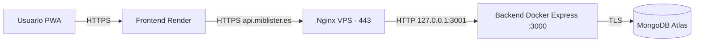

# 08 - Despliegue evaluación

Este documento complementa a [08-despliegue.md](08-despliegue.md) y se centra exclusivamente en las evidencias necesarias para evaluar la parte de despliegue del proyecto. La descripción histórica, las decisiones de arquitectura y la fase Render se mantienen en el documento general; aquí se concentra la verificación reproducible de los criterios obligatorios 7 y 8 sobre el despliegue real en producción.

## Índice

1. [Resumen del despliegue actual](#1-resumen-del-despliegue-actual)
2. [Criterio 7 - Gestión básica de ficheros y artefactos del despliegue](#2-criterio-7---gestión-básica-de-ficheros-y-artefactos-del-despliegue)
3. [Criterio 8 - Verificación básica de red del despliegue](#3-criterio-8---verificación-básica-de-red-del-despliegue)

## Despliegue de la aplicación web

### 1. Resumen del despliegue actual

Blíster está desplegado en producción como una aplicación cliente-servidor con base de datos gestionada y dos infraestructuras separadas. La PWA se sirve como sitio estático en Render y el backend corre dentro de un contenedor Docker en una VPS Ubuntu, publicado bajo HTTPS mediante Nginx y Certbot. El motivo de mover el backend a una VPS fue evitar el apagado automático del tier gratuito de Render: la VPS la facilita un familiar, lo que permite tener el backend siempre activo sin coste adicional.

| Componente | Ubicación real | Función |
| :--- | :--- | :--- |
| Frontend | Render (Static Site) | PWA construida con Vite, accesible bajo HTTPS gestionado por Render. |
| Backend | VPS Ionos Ubuntu, contenedor Docker | API REST, MCP, OAuth, push y correo Resend. |
| Base de datos | MongoDB Atlas | Persistencia gestionada con TLS y backups automáticos. |
| Reverse proxy | Nginx en la VPS | Termina HTTPS y reenvía a `127.0.0.1:3001`. |
| HTTPS | Let's Encrypt vía Certbot | Certificado para `api.miblister.es` con renovación automática. |
| CI/CD | GitHub Actions | CI en cada push y CD del backend por SSH al hacer push a `dev`. |

URLs públicas relevantes:

| Recurso | URL |
| :--- | :--- |
| Frontend | `https://miblister.es` |
| API pública | `https://api.miblister.es` |
| Healthcheck | `https://api.miblister.es/api/v1/health` |
| Swagger | `https://api.miblister.es/api/v1/docs` |
| MCP (Streamable HTTP) | `https://api.miblister.es/mcp` |

Flujo de una petición real:



### 2. Criterio 7 - Gestión básica de ficheros y artefactos del despliegue

Este criterio exige identificar qué ficheros componen el despliegue, dónde están y para qué sirve cada uno. En el caso de Blíster los artefactos se reparten entre el repositorio (todo lo reproducible) y la VPS (configuración con secretos y certificados). El siguiente desglose explica cada uno.

#### 3.1 Ruta del proyecto en la VPS

El backend está desplegado en la VPS Ubuntu bajo el usuario `fran`, dentro del directorio `~/apps/daw2-blister-proyecto-final`, que se corresponde con la ruta absoluta `/home/fran/apps/daw2-blister-proyecto-final`. El despliegue automatizado descrito en la sección 3.8 trabaja siempre desde esa ruta.

```bash
fran@vps:~$ cd ~/apps/daw2-blister-proyecto-final
fran@vps:~/apps/daw2-blister-proyecto-final$ pwd
/home/fran/apps/daw2-blister-proyecto-final
fran@vps:~/apps/daw2-blister-proyecto-final$ ls -la
drwxrwxr-x  fran fran   .
drwxrwxr-x  fran fran   ..
drwxrwxr-x  fran fran   .git
drwxrwxr-x  fran fran   .github
-rw-rw-r--  fran fran   .gitignore
-rw-rw-r--  fran fran   .env.example
-rw-rw-r--  fran fran   compose.yaml
-rw-rw-r--  fran fran   docker-compose.backend.yml
drwxrwxr-x  fran fran   backend
drwxrwxr-x  fran fran   frontend
drwxrwxr-x  fran fran   shared
drwxrwxr-x  fran fran   docs
-rw-rw-r--  fran fran   README.md
```


Esta evidencia demuestra que el proyecto está clonado en la ruta esperada y que en raíz conviven el `compose.yaml` general (heredado de la fase Docker local) y el `docker-compose.backend.yml` realmente usado en producción.

#### 2.2 Ficheros importantes localizados en el repositorio

Para detectar de un vistazo los artefactos clave se usa un único `find`:

```bash
find . -maxdepth 3 -type f \
  \( -name "compose*.yml" -o -name "compose*.yaml" \
     -o -name "Dockerfile" -o -name ".env.example" \)
```

Salida obtenida:

```text
./compose.yaml
./docker-compose.backend.yml
./.env.example
./backend/Dockerfile
./backend/.env.example
./frontend/Dockerfile
```

| Fichero | Función |
| :--- | :--- |
| `compose.yaml` | Compose completo (mongo + backend + frontend) usado para validación local. |
| `docker-compose.backend.yml` | Compose real usado en producción: solo backend, conectado a Atlas. |
| `backend/Dockerfile` | Build multi-stage Node 22 Alpine que compila TypeScript y arranca `dist/backend/src/index.js`. |
| `frontend/Dockerfile` | Build Vite + Nginx, usado únicamente para validación local. |
| `backend/.env.example` | Plantilla de variables documentada y versionada, sin secretos. |
| `.env.example` | Variables de ejemplo del Compose general. |

#### 2.3 Dockerfile del backend

```dockerfile
FROM node:22-alpine AS builder
WORKDIR /app
COPY backend/package*.json ./backend/
RUN cd backend && npm ci
COPY backend ./backend
COPY shared ./shared
RUN cd backend && npm run build && npm prune --omit=dev

FROM node:22-alpine AS runner
WORKDIR /app/backend
ENV NODE_ENV=production
COPY --from=builder /app/backend/package*.json ./
COPY --from=builder /app/backend/node_modules ./node_modules
COPY --from=builder /app/backend/dist ./dist
EXPOSE 3000
CMD ["node", "dist/backend/src/index.js"]
```

El multi-stage separa build (con devDependencies y código TypeScript) y runtime (solo `dist`, `node_modules` ya purgados con `npm prune --omit=dev` y package.json). El contenedor expone únicamente el puerto `3000` interno.

#### 2.4 Compose real usado en producción

El fichero `docker-compose.backend.yml` es el que realmente levanta el servicio en la VPS. No incluye Mongo porque la base de datos vive en Atlas, ni frontend porque está en Render.

```yaml
services:
  backend:
    build:
      context: .
      dockerfile: backend/Dockerfile
    restart: unless-stopped
    env_file:
      - ./backend/.env
    environment:
      NODE_ENV: production
      PORT: 3000
    ports:
      - "3001:3000"
```

Comprobación del estado y de la configuración resuelta:

```bash
docker compose -f docker-compose.backend.yml ps
```

```text
NAME                                                 IMAGE                                              COMMAND                  SERVICE   CREATED      STATUS                PORTS
daw2-blister-proyecto-final-backend-1                daw2-blister-proyecto-final-backend                "docker-entrypoint.s…"   backend   2 days ago   Up 2 days (healthy)   0.0.0.0:3001->3000/tcp, [::]:3001->3000/tcp
```


Esta evidencia demuestra dos cosas: el contenedor lleva tiempo activo con `restart: unless-stopped`, y el único puerto publicado en la VPS es `3001`, que es a donde apunta Nginx. El `3000` queda confinado al contenedor.

`docker compose config` se usa para inspeccionar la configuración efectiva (con variables expandidas) sin tocar el contenedor:

```bash
docker compose -f docker-compose.backend.yml config
```

Esto resulta útil para verificar que `env_file` se aplica correctamente y que ninguna variable obligatoria queda sin valor.

#### 2.5 Variables de entorno en producción

El fichero `backend/.env` vive solo en la VPS, fuera del repositorio. Para aportar evidencia de su contenido sin exponer secretos se usa una redacción automática:

```bash
grep -v '^#' backend/.env | sed -E 's/=.*/=<REDACTADO>/'
```

Salida resumida (orden y nombres reales del fichero, valores ocultos):


Esta evidencia demuestra que las variables esperadas existen en el entorno de producción sin revelar ningún valor sensible. La plantilla `backend/.env.example`, ya en el repositorio, documenta cada variable y su uso para que el despliegue sea reproducible.

#### 2.6 Configuración Nginx

La configuración real del site `api.miblister.es` se encuentra en la VPS en `/etc/nginx/sites-available/miblister-api` y está enlazada desde `sites-enabled`:

```bash
sudo cat /etc/nginx/sites-available/miblister-api
```

```nginx
server {
    server_name api.miblister.es;

    location / {
        proxy_pass http://127.0.0.1:3001;
        proxy_http_version 1.1;

        proxy_set_header Host $host;
        proxy_set_header X-Real-IP $remote_addr;
        proxy_set_header X-Forwarded-For $proxy_add_x_forwarded_for;
        proxy_set_header X-Forwarded-Proto $scheme;

        # 1. Permitir que el Bearer token de Claude/MCP llegue al backend
        proxy_set_header Authorization $http_authorization;
        proxy_pass_header  Authorization;

        # 2. Configuración necesaria para MCP (Streamable HTTP / SSE)
        proxy_set_header Connection '';
        proxy_cache off;
        proxy_buffering off;
        proxy_read_timeout 86400s;
    }

    listen 443 ssl; # managed by Certbot
    ssl_certificate     /etc/letsencrypt/live/api.miblister.es/fullchain.pem; # managed by Certbot
    ssl_certificate_key /etc/letsencrypt/live/api.miblister.es/privkey.pem;   # managed by Certbot
    include /etc/letsencrypt/options-ssl-nginx.conf;                          # managed by Certbot
    ssl_dhparam /etc/letsencrypt/ssl-dhparams.pem;                            # managed by Certbot
}

server {
    if ($host = api.miblister.es) {
        return 301 https://$host$request_uri;
    } # managed by Certbot

    listen 80;
    server_name api.miblister.es;
    return 404; # managed by Certbot
}
```

```bash
ls -l /etc/nginx/sites-enabled/
```

```text
lrwxrwxrwx  miblister-api -> /etc/nginx/sites-available/miblister-api
```


Esta evidencia demuestra que el dominio `api.miblister.es` está servido por un único site dedicado, que incluye HTTPS gestionado por Certbot, redirección 80→443 y los ajustes específicos para que MCP funcione correctamente con OAuth y Streamable HTTP.

#### 2.7 Imágenes, volúmenes y persistencia

| Artefacto | Origen | Notas |
| :--- | :--- | :--- |
| Imagen `node:22-alpine` | Docker Hub oficial | Base del Dockerfile multi-stage. |
| Imagen `daw2-blister-proyecto-final-backend` | Generada en la VPS por `docker compose build` | Es la que ejecuta el contenedor en producción. No se publica en un registry público. |
| Volúmenes | Ninguno | El backend es stateless: toda la persistencia está en MongoDB Atlas. |
| Datos persistentes | MongoDB Atlas | Backups automáticos gestionados por el servicio. |

El Compose general `compose.yaml` sí declara el volumen `mongo-data` para uso local, pero ese servicio no se utiliza en producción.

#### 2.8 Ficheros excluidos del repositorio y reconstrucción

Los siguientes ficheros nunca deben subirse al repositorio porque contienen secretos o estado local:

| Patrón | Motivo |
| :--- | :--- |
| `backend/.env`, `frontend/.env` | Contienen secretos (JWT, Atlas, Resend, VAPID). |
| `node_modules/` | Dependencias reproducibles vía `npm ci`. |
| `dist/`, `coverage/`, `tmp/` | Artefactos generados, no fuentes. |
| Certificados de `/etc/letsencrypt` | Gestionados por Certbot en la VPS, fuera del repo. |

El redespliegue se realiza de dos formas equivalentes:

1. **Automático (CD):** push a la rama `dev` dispara `.github/workflows/deploy-vps.yml`, que entra por SSH y ejecuta `git pull --rebase`, `docker compose -f docker-compose.backend.yml up -d --build` y `docker image prune -f`.
2. **Manual:** ejecutando esos mismos comandos por SSH desde `~/apps/daw2-blister-proyecto-final` cuando interesa intervenir directamente.

### 3. Criterio 8 - Verificación básica de red del despliegue

Este criterio exige demostrar que el despliegue es accesible y entender los parámetros de red implicados: dominio, puertos, rutas, proxy y comunicación entre servicios. Las siguientes evidencias se obtienen directamente sobre la VPS y sobre la URL pública.

#### 3.1 URL pública, puertos y rutas

| Elemento | Valor |
| :--- | :--- |
| Dominio público | `api.miblister.es` (registro A → IP pública de la VPS). |
| Puertos abiertos al exterior | `80` (redirección 301) y `443` (HTTPS). |
| Puerto Docker publicado en la VPS | `3001` solo accesible desde `127.0.0.1` mediante Nginx. |
| Puerto interno del contenedor | `3000` (Express). |
| Healthcheck | `GET /api/v1/health`. |
| Documentación | `GET /api/v1/docs` (Swagger UI). |
| MCP Streamable HTTP | `GET/POST/DELETE /mcp`. |

#### 3.2 Estado de puertos en escucha

Para evidenciar qué procesos escuchan en cada puerto:

```bash
sudo ss -tulpn | grep -E ':(80|443|3000|3001)'
```

Salida típica:

```text
tcp   LISTEN  0  511   0.0.0.0:80     0.0.0.0:*  users:(("nginx",pid=...,fd=6))
tcp   LISTEN  0  511   0.0.0.0:443    0.0.0.0:*  users:(("nginx",pid=...,fd=7))
tcp   LISTEN  0  4096  0.0.0.0:3001   0.0.0.0:*  users:(("docker-proxy",pid=...,fd=4))
tcp   LISTEN  0  511   [::]:80        [::]:*     users:(("nginx",...))
tcp   LISTEN  0  511   [::]:443       [::]:*     users:(("nginx",...))
```


Esta evidencia demuestra el reparto: Nginx escucha en `80` y `443` (acceso público), Docker publica `3001` (acceso local) y `3000` no aparece porque vive solo dentro del contenedor.

El firewall de la VPS también deja claro qué tráfico se permite:

```bash
sudo ufw status verbose
```

```text
Status: active
Default: deny (incoming), allow (outgoing)

To                         Action      From
--                         ------      ----
22/tcp (OpenSSH)           ALLOW IN    Anywhere
80,443/tcp (Nginx Full)    ALLOW IN    Anywhere
22/tcp (OpenSSH (v6))      ALLOW IN    Anywhere (v6)
80,443/tcp (Nginx Full v6) ALLOW IN    Anywhere (v6)
```

El puerto `3001` no está permitido desde el exterior, lo que confirma que no se puede saltar a Express directamente: el tráfico público obliga a pasar por Nginx.

#### 3.3 Healthcheck local y público

Comprobación local en la VPS, contra el puerto del contenedor:

```bash
curl -i http://127.0.0.1:3001/api/v1/health
```

```text
HTTP/1.1 200 OK
Content-Type: application/json; charset=utf-8

{"success":true,"data":{"status":"ok"}}
```

Comprobación pública desde Internet, contra el dominio:

```bash
curl -i https://api.miblister.es/api/v1/health
```

```text
HTTP/1.1 200 OK
Server: nginx/1.24.0 (Ubuntu)
Content-Type: application/json; charset=utf-8
Strict-Transport-Security: max-age=63072000; includeSubDomains; preload

{"success":true,"data":{"status":"ok"}}
```


Esta evidencia demuestra que la misma respuesta JSON se obtiene por dos rutas distintas: la primera (`127.0.0.1:3001`) prueba que el contenedor responde; la segunda (HTTPS pública) prueba que Nginx + Certbot + reverse proxy + DNS están funcionando juntos. Que ambas respuestas coincidan confirma que el proxy no altera el contenido.

Adicionalmente, una petición `HEAD` contra Swagger demuestra que la ruta `/api/v1/docs` también queda publicada por el mismo proxy:

```bash
curl -I https://api.miblister.es/api/v1/docs
```

```text
HTTP/1.1 200 OK
Content-Type: text/html; charset=utf-8
```

#### 3.4 Comprobación de Nginx y certificado

Antes de cualquier recarga se valida la sintaxis de Nginx:

```bash
sudo nginx -t
```

```text
nginx: the configuration file /etc/nginx/nginx.conf syntax is ok
nginx: configuration file /etc/nginx/nginx.conf test is successful
```

El certificado HTTPS se inspecciona con Certbot:

```bash
sudo certbot certificates
```


Esta evidencia demuestra que la configuración Nginx es sintácticamente correcta y que el certificado emitido por Let's Encrypt está activo y vinculado al dominio público. La renovación es automática mediante el timer de Certbot.

#### 3.5 Comunicación end-to-end y diferencia entre acceso público y local

El recorrido completo de una petición es:

1. El navegador (PWA en Render) llama a `https://api.miblister.es/api/v1/...`.
2. DNS resuelve el dominio a la IP pública de la VPS.
3. Nginx en la VPS termina TLS en el puerto `443` y, según el bloque `location /`, hace `proxy_pass http://127.0.0.1:3001`.
4. Docker reenvía ese tráfico al contenedor backend, que escucha internamente en el `3000`.
5. Express atiende la ruta, y para datos persistentes habla con MongoDB Atlas mediante TLS.
6. La respuesta vuelve al navegador a través de Nginx con HTTPS.

| Tipo de acceso | URL | Quién responde | Por qué se distinguen |
| :--- | :--- | :--- | :--- |
| Público | `https://api.miblister.es/api/v1/health` | Nginx → Docker → Express | Es la única vía abierta a Internet, con HTTPS y proxy. |
| Local en la VPS | `http://127.0.0.1:3001/api/v1/health` | Docker → Express | Sirve para depurar sin pasar por Nginx; no accesible desde fuera. |
| Interno al contenedor | `http://localhost:3000/api/v1/health` | Express | Solo tiene sentido dentro del propio contenedor. |

Que las tres rutas devuelvan el mismo JSON es lo que demuestra que el proxy no rompe el flujo y que cada capa cumple su papel.

#### 4.6 Estado del contenedor y logs

La última comprobación combina el estado del servicio con sus logs recientes para confirmar que no hay errores al servir tráfico real:

```bash
docker compose -f docker-compose.backend.yml ps
docker compose -f docker-compose.backend.yml logs --tail=80 backend
```

Salida resumida (extracto):


Esta evidencia demuestra que el contenedor está Up y escuchando en el puerto 3000 (mapeado al 3001 del host), que las variables de entorno se inyectan correctamente desde .env al arranque, y que las peticiones reales procedentes de IPs externas llegan al backend a través del proxy nginx, confirmando que el enrutamiento dominio → nginx → contenedor funciona de extremo a extremo.
