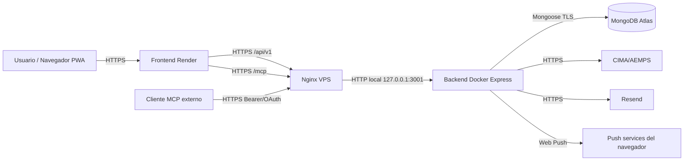

# 08 - Despliegue

El despliegue de Blíster evolucionó en tres fases: primero se dockerizó el sistema completo para validar portabilidad; después se publicó backend y frontend en Render usando MongoDB Atlas; finalmente se trasladó el backend a una VPS de Ionos con Docker, Nginx y HTTPS, manteniendo el frontend en Render. Este capítulo documenta esa evolución y la configuración técnica resultante.

> Para la parte específica de evaluación del módulo (criterios 7 y 8 sobre artefactos y verificación de red), véase [08-despliegue-eval.md](08-despliegue-eval.md).

## Índice

1. [Visión general](#1-visión-general)
2. [Fase 1: Dockerización local](#2-fase-1-dockerización-local)
  - 2.1 [Servicios dockerizados](#21-servicios-dockerizados)
  - 2.2 [Compose local](#22-compose-local)
3. [Fase 2: Despliegue inicial en Render](#3-fase-2-despliegue-inicial-en-render)
  - 3.1 [Backend en Render](#31-backend-en-render)
  - 3.2 [Frontend en Render](#32-frontend-en-render)
4. [Fase 3: Backend en VPS Ionos](#4-fase-3-backend-en-vps-ionos)
  - 4.1 [Preparación del servidor](#41-preparación-del-servidor)
  - 4.2 [Clonado y archivo Compose del backend](#42-clonado-y-archivo-compose-del-backend)
  - 4.3 [Variables de producción del backend](#43-variables-de-producción-del-backend)
  - 4.4 [Construcción y arranque](#44-construcción-y-arranque)
  - 4.5 [Nginx como reverse proxy](#45-nginx-como-reverse-proxy)
  - 4.6 [HTTPS con Certbot](#46-https-con-certbot)
5. [Arquitectura final de producción](#5-arquitectura-final-de-producción)
6. [Variables de entorno de producción](#6-variables-de-entorno-de-producción)
7. [CI/CD y redespliegue](#7-cicd-y-redespliegue)
8. [Verificación posterior al despliegue](#8-verificación-posterior-al-despliegue)
9. [URLs y evidencias](#9-urls-y-evidencias)
10. [Mantenimiento y resolución de problemas](#10-mantenimiento-y-resolución-de-problemas)

## 1. Visión general

Blíster se despliega como una aplicación cliente-servidor con base de datos externa. La PWA se sirve como aplicación estática y el backend concentra API REST, MCP, OAuth, notificaciones, correo y conexión con MongoDB.

| Servicio | Producción final | Función |
| :--- | :--- | :--- |
| Frontend | Render | Sitio estático PWA construido desde `frontend`. |
| Backend | VPS Ionos Ubuntu 24.04 | Contenedor Docker con Express, API REST y `/mcp`. |
| Base de datos | MongoDB Atlas | Persistencia gestionada. |
| Proxy HTTPS | Nginx + Certbot en VPS | Publicación segura de `api.miblister.es`. |
| CI | GitHub Actions | Lint, tests, cobertura y build. |

La separación final permite que el frontend se redespliegue fácilmente desde Render y que el backend se controle en una VPS con Docker y Nginx.

El despliegue se documenta en orden cronológico porque cada fase resolvió un problema distinto:

| Fase | Problema que resolvió | Resultado conservado |
| :--- | :--- | :--- |
| Docker local | Reproducir la aplicación completa fuera del entorno de desarrollo. | Dockerfiles, `compose.yaml` y Nginx local. |
| Render | Publicar una primera versión accesible con HTTPS y Atlas. | Frontend público con redeploy automático. |
| VPS Ionos | Controlar el backend, dominio de API y certificados. | `api.miblister.es` con Docker, Nginx y Certbot. |

La arquitectura final no elimina lo aprendido en fases previas. Docker Compose sigue siendo útil para validar cambios; Render sigue sirviendo la PWA; y la VPS concentra la parte de servidor que requiere mayor control operativo.

## 2. Fase 1: Dockerización local

La primera fase consistió en hacer que la aplicación completa pudiera arrancar fuera del entorno local de desarrollo. Para ello se añadieron Dockerfiles para backend y frontend, un `compose.yaml` y una configuración Nginx para servir la PWA y reenviar API/MCP.

### 2.1 Servicios dockerizados

| Servicio | Imagen/base | Detalle |
| :--- | :--- | :--- |
| `mongo` | `mongo:7` | Base de datos local con volumen `mongo-data`. |
| `backend` | `node:22-alpine` | Build TypeScript y ejecución de `dist/backend/src/index.js`. |
| `frontend` | `node:22-alpine` + `nginx:1.27-alpine` | Build Vite y servidor estático. |

Archivos implicados en esta fase:

| Archivo | Función |
| :--- | :--- |
| `compose.yaml` | Define servicios, red interna, variables y volúmenes. |
| `backend/Dockerfile` | Instala dependencias, compila TypeScript y arranca Express. |
| `frontend/Dockerfile` | Construye Vite y copia `dist` a Nginx. |
| `frontend/nginx/default.conf` | Sirve la PWA y reenvía API/MCP al backend. |
| `.dockerignore` | Evita copiar dependencias locales y archivos innecesarios. |

### 2.2 Compose local

El `compose.yaml` levanta la aplicación con una única entrada pública en `http://localhost:8080`. El backend y MongoDB quedan en una red interna y Nginx reenvía:

| Ruta pública | Destino interno |
| :--- | :--- |
| `/` | Archivos estáticos del frontend. |
| `/api/v1/` | `backend:3000/api/v1/`. |
| `/mcp` | `backend:3000/mcp`. |

Comandos de validación:

```bash
docker compose up -d --build
curl http://localhost:8080/api/v1/health
docker compose ps
```

Esta fase demostró que frontend, backend y base de datos podían reconstruirse de forma reproducible y que el endpoint MCP funcionaba detrás de un proxy.

La dockerización local también sirvió para detectar dependencias implícitas. Si una variable de entorno faltaba, si el frontend apuntaba a un puerto incorrecto o si Nginx no reenviaba `/mcp`, el problema aparecía antes de subir a producción.

| Comprobación | Qué demuestra |
| :--- | :--- |
| `docker compose ps` | Los tres servicios están levantados. |
| Healthcheck por `localhost:8080` | Nginx reenvía correctamente a backend. |
| Acceso a `/` | La PWA se sirve como estático. |
| Acceso a `/api/v1/docs` | Swagger queda accesible detrás del proxy. |
| Prueba MCP | El endpoint no queda bloqueado por parsers o proxy. |

Problemas habituales en esta fase:

| Síntoma | Revisión inmediata |
| :--- | :--- |
| `backend` reinicia continuamente | Variables obligatorias o conexión MongoDB. |
| Frontend abre pero API falla | Configuración Nginx o ruta `/api/v1`. |
| Puerto `8080` ocupado | Cambiar el puerto externo del servicio frontend. |
| Imágenes antiguas | Reconstruir con `docker compose build --no-cache`. |
| Volumen con datos previos | Eliminar volumen solo si se acepta perder datos locales. |

## 3. Fase 2: Despliegue inicial en Render

La segunda fase publicó la aplicación en Render para disponer de una URL pública temprana. Se crearon servicios separados para frontend y backend, ambos conectados al repositorio para redesplegar al hacer push en la rama configurada.

### 3.1 Backend en Render

Configuración del servicio:

| Campo | Valor |
| :--- | :--- |
| Tipo | Web Service Node |
| Root Directory | `backend` |
| Build Command | `npm ci && npm run build` |
| Start Command | `node dist/backend/src/index.js` |
| Base de datos | MongoDB Atlas mediante `MONGODB_URI` |

Variables destacadas:

```text
NODE_ENV=production
MONGODB_URI=mongodb+srv://...
BACKEND_URL=https://api.miblister.es
CLIENT_ORIGIN=https://blister-app.onrender.com
CLIENT_ORIGINS=https://blister-app.onrender.com,https://miblister.es,https://www.miblister.es
CIMA_BASE_URL=https://cima.aemps.es/cima/rest
JWT_SECRET=<secreto largo>
MCP_SERVER_ENABLED=true
```

Render asigna el puerto mediante `PORT`, por lo que el backend solo necesita leer `process.env.PORT`.

Durante la fase Render, MongoDB Atlas evitó tener que administrar una base de datos en el mismo proveedor. La conexión se concentró en `MONGODB_URI`, manteniendo el resto del backend idéntico al entorno local salvo URLs, secretos y CORS.

Cuando el backend se migró a la VPS, el aprendizaje principal de esta fase se mantuvo: las variables deben declarar explícitamente qué frontend puede llamar a la API y qué URL pública usa el propio servidor para generar enlaces o metadatos.

### 3.2 Frontend en Render

Configuración del servicio:

| Campo | Valor |
| :--- | :--- |
| Tipo | Static Site o Web Service estático |
| Root Directory | `frontend` |
| Build Command | `npm ci && npm run build` |
| Publish Directory | `dist` |

Variables de build:

```text
VITE_API_URL=https://api.miblister.es
VITE_MCP_URL=https://api.miblister.es
```

Render recompila la PWA al recibir cambios en la rama configurada. Esta fase permitió validar la aplicación desde una URL pública, con base de datos Atlas y HTTPS gestionado por la plataforma.

La parte estática del frontend encaja bien en Render porque Vite genera un directorio `dist` independiente. No necesita proceso Node en ejecución para servir la interfaz, salvo que se prefiera usar un servicio web estático. Las variables `VITE_*` se inyectan en tiempo de build, por lo que un cambio de backend requiere reconstruir la PWA.

Secuencia seguida en Render:

| Paso | Acción |
| :--- | :--- |
| 1 | Conectar el repositorio GitHub. |
| 2 | Crear servicio backend con raíz `backend`. |
| 3 | Añadir variables de entorno y `MONGODB_URI` de Atlas. |
| 4 | Crear servicio frontend con raíz `frontend`. |
| 5 | Configurar variables `VITE_API_URL` y `VITE_MCP_URL`. |
| 6 | Activar despliegue automático en la rama elegida. |
| 7 | Validar login, CIMA, Swagger y healthcheck. |

La ventaja de Render fue publicar rápido. La limitación principal fue el menor control operativo del backend, especialmente para procesos persistentes, logs y ajustes finos de proxy. Esa limitación motivó la migración posterior del backend a la VPS.

## 4. Fase 3: Backend en VPS Ionos

La fase final trasladó el backend a una VPS Ionos con Ubuntu 24.04. El frontend permaneció en Render y la base de datos siguió en MongoDB Atlas. El objetivo era tener mayor control sobre el backend y evitar limitaciones propias de plataformas gestionadas.

### 4.1 Preparación del servidor

La administración se realizó por SSH en una instalación sin entorno gráfico. En la VPS se instalaron dependencias base, Docker Engine y el plugin de Docker Compose desde el repositorio oficial de Docker para Ubuntu.

Comandos principales:

```bash
sudo apt update
sudo apt install -y ca-certificates curl gnupg
sudo install -m 0755 -d /etc/apt/keyrings
curl -fsSL https://download.docker.com/linux/ubuntu/gpg | sudo gpg --dearmor -o /etc/apt/keyrings/docker.gpg
sudo chmod a+r /etc/apt/keyrings/docker.gpg
```

Después se añadió el repositorio estable de Docker y se instalaron los paquetes:

```bash
sudo apt update
sudo apt install -y docker-ce docker-ce-cli containerd.io docker-buildx-plugin docker-compose-plugin
```

El usuario de despliegue se añadió al grupo `docker` para poder administrar contenedores sin `sudo` en cada comando.

Además de Docker, la VPS necesita DNS, firewall y Nginx correctamente coordinados. El subdominio `api.miblister.es` debe apuntar a la IP pública del servidor, el puerto 80 debe estar disponible para Certbot y el 443 debe quedar abierto para tráfico HTTPS.

| Elemento | Configuración esperada |
| :--- | :--- |
| DNS | Registro A de `api.miblister.es` hacia la IP de la VPS. |
| Firewall | HTTP/80 y HTTPS/443 permitidos. |
| Docker | Servicio activo y usuario autorizado. |
| Nginx | Site específico para `api.miblister.es`. |
| Certbot | Certificado emitido y renovación automática. |

### 4.2 Clonado y archivo Compose del backend

En la VPS se clonó el repositorio y se preparó un Compose específico para backend, porque MongoDB ya estaba en Atlas y el frontend seguía en Render.

```yaml
services:
  backend:
    build:
      context: .
      dockerfile: backend/Dockerfile
    restart: unless-stopped
    env_file:
      - ./backend/.env
    environment:
      NODE_ENV: production
      PORT: 3000
    ports:
      - "3001:3000"
```

El backend escucha internamente en `3000` y se publica en el puerto `3001` de la VPS para que Nginx pueda reenviar tráfico local.

La exposición del contenedor se limita a la máquina. El usuario final no consume `:3001`; entra siempre por HTTPS y por el dominio público. Esta separación permite cambiar el puerto interno sin modificar el frontend, siempre que Nginx siga reenviando al destino correcto.

Estructura del backend en la VPS:

```text
/home/fran/apps/daw2-blister-proyecto-final/
├── backend/.env
├── docker-compose.backend.yml
├── backend/Dockerfile
├── backend/src/
├── shared/
└── package files del monorepo
```

La ruta real del proyecto en la VPS es `~/apps/daw2-blister-proyecto-final`, propiedad del usuario `fran`. El despliegue automatizado (sección 7) y el redespliegue manual operan siempre desde ese directorio.

El archivo `.env` de producción debe tener permisos restrictivos y no debe copiarse al repositorio. Si se necesita compartir configuración, se documentan nombres de variables, no valores reales.

### 4.3 Variables de producción del backend

El archivo `backend/.env` de la VPS usa Atlas y el dominio real del frontend:

```text
NODE_ENV=production
PORT=3000
MONGODB_URI=mongodb+srv://...
BACKEND_URL=https://api.miblister.es
CLIENT_ORIGIN=https://miblister.es
CLIENT_ORIGINS=https://miblister.es,https://www.miblister.es
CIMA_BASE_URL=https://cima.aemps.es/cima/rest
JWT_SECRET=<secreto largo>
JWT_ACCESS_EXPIRES_IN=15m
JWT_REFRESH_EXPIRES_IN=7d
MCP_TOKEN_TTL_DAYS=90
MCP_SERVER_ENABLED=true
WEB_PUSH_VAPID_PUBLIC_KEY=<clave pública>
WEB_PUSH_VAPID_PRIVATE_KEY=<clave privada>
WEB_PUSH_VAPID_SUBJECT=mailto:<correo>
PUSH_REMINDER_SCAN_INTERVAL_MS=60000
RESEND_API_KEY=<clave Resend>
```

Los secretos no forman parte del repositorio y se mantienen únicamente en el entorno de producción.

Las variables sensibles deben revisarse en tres grupos:

| Grupo | Variables |
| :--- | :--- |
| Sesión y seguridad | `JWT_SECRET`, expiraciones, refresh token y CORS. |
| Integraciones | `RESEND_API_KEY`, claves VAPID y `CIMA_BASE_URL`. |
| Publicación | `BACKEND_URL`, `CLIENT_ORIGIN`, `CLIENT_ORIGINS` y `PORT`. |

Una configuración incorrecta de CORS suele manifestarse como error en navegador aunque el backend responda correctamente por `curl`. Por eso se comprueba tanto desde terminal como desde el frontend real.

### 4.4 Construcción y arranque

```bash
docker compose -f docker-compose.backend.yml up -d --build
docker ps
docker compose -f docker-compose.backend.yml logs -f backend
curl http://localhost:3001/api/v1/health
```

Respuesta esperada:

```json
{
  "success": true,
  "data": {
    "status": "ok"
  }
}
```

### 4.5 Nginx como reverse proxy

Se creó el subdominio `api.miblister.es` apuntando a la IP pública de la VPS mediante un registro A. En el servidor se configuró Nginx como proxy hacia el contenedor mediante un site específico en `/etc/nginx/sites-available/miblister-api`. La configuración real, después de pasar Certbot y ajustarla para soportar correctamente OAuth y el transporte Streamable HTTP de MCP, es la siguiente:

```nginx
server {
    server_name api.miblister.es;

    location / {
        proxy_pass http://127.0.0.1:3001;

        proxy_http_version 1.1;

        proxy_set_header Host $host;
        proxy_set_header X-Real-IP $remote_addr;
        proxy_set_header X-Forwarded-For $proxy_add_x_forwarded_for;
        proxy_set_header X-Forwarded-Proto $scheme;

        # 1. Permitir que el Bearer token de Claude/MCP llegue al backend
        proxy_set_header Authorization $http_authorization;
        proxy_pass_header  Authorization;

        # 2. Configuración necesaria para MCP (Streamable HTTP / SSE)
        proxy_set_header Connection '';
        proxy_cache off;
        proxy_buffering off;
        proxy_read_timeout 86400s;
    }

    listen 443 ssl; # managed by Certbot
    ssl_certificate     /etc/letsencrypt/live/api.miblister.es/fullchain.pem; # managed by Certbot
    ssl_certificate_key /etc/letsencrypt/live/api.miblister.es/privkey.pem;   # managed by Certbot
    include /etc/letsencrypt/options-ssl-nginx.conf;                          # managed by Certbot
    ssl_dhparam /etc/letsencrypt/ssl-dhparams.pem;                            # managed by Certbot
}

server {
    if ($host = api.miblister.es) {
        return 301 https://$host$request_uri;
    } # managed by Certbot

    listen 80;
    server_name api.miblister.es;
    return 404; # managed by Certbot
}
```

Los dos bloques `server` se complementan: el primero termina TLS y reenvía a `127.0.0.1:3001`; el segundo escucha en HTTP y redirige cualquier acceso a `http://api.miblister.es` hacia HTTPS. Las directivas añadidas a `location /` son específicas del proyecto:

| Directiva | Motivo |
| :--- | :--- |
| `proxy_set_header Authorization` y `proxy_pass_header Authorization` | Garantizan que el Bearer token de OAuth/MCP llegue íntegro al backend Express. |
| `proxy_set_header Connection ''` | Evita el cierre prematuro de la conexión cuando MCP usa el transporte Streamable HTTP. |
| `proxy_cache off`, `proxy_buffering off` | Desactivan buffer y caché de Nginx para que los eventos se entreguen en streaming. |
| `proxy_read_timeout 86400s` | Permite mantener abiertas sesiones MCP largas sin que Nginx corte por inactividad. |

Activación y comprobación:

```bash
sudo ln -s /etc/nginx/sites-available/miblister-api /etc/nginx/sites-enabled/miblister-api
sudo nginx -t
sudo systemctl reload nginx
curl http://api.miblister.es/api/v1/health
```

Si el enlace simbólico ya existe, no es necesario recrearlo. La comprobación importante es `sudo nginx -t`, que debe confirmar que la sintaxis es correcta antes de recargar el servicio.

Las cabeceras proxy mantienen información de la petición original. Esto es útil para logs, generación de URLs y futuras reglas dependientes de protocolo u origen.

| Cabecera | Motivo |
| :--- | :--- |
| `Host` | Conserva el dominio solicitado. |
| `X-Real-IP` | Permite conocer la IP del cliente. |
| `X-Forwarded-For` | Mantiene cadena de proxies. |
| `X-Forwarded-Proto` | Informa si la petición original llegó por HTTPS. |

### 4.6 HTTPS con Certbot

El frontend de Render se sirve por HTTPS. Consumir un backend HTTP produciría bloqueo por Mixed Content, por lo que el subdominio de API se protegió con Certbot:

```bash
sudo snap install --classic certbot
sudo ln -s /snap/bin/certbot /usr/bin/certbot
sudo certbot --nginx -d api.miblister.es
curl https://api.miblister.es/api/v1/health
```

Durante la emisión del certificado se seleccionó la redirección automática de HTTP a HTTPS. De este modo, cualquier acceso a `http://api.miblister.es` termina resolviendo por el canal seguro.

Con el certificado activo, el frontend puede consumir:

```text
https://api.miblister.es
```

Las variables de Render para el frontend quedan así:

```text
VITE_API_URL=https://api.miblister.es
VITE_MCP_URL=https://api.miblister.es
```

Al tratarse de variables `VITE_*`, el cambio requiere redesplegar el frontend en Render para que la PWA reconstruida use el dominio definitivo de la API.

Esta configuración evita Mixed Content. Si el frontend se sirve por HTTPS y la API por HTTP, el navegador bloqueará las llamadas aunque el servidor responda correctamente. Por eso el certificado no es un detalle opcional, sino una condición para que la aplicación funcione en producción.

## 5. Arquitectura final de producción



La arquitectura final conserva la separación entre cliente y servidor, pero el backend queda bajo control directo en la VPS.

| Decisión | Justificación |
| :--- | :--- |
| Frontend en Render | Build automático, HTTPS gestionado y servicio estático sencillo. |
| Backend en VPS | Control de proceso, logs, proxy, dominio y contenedor. |
| MongoDB Atlas | Backups, TLS, disponibilidad y separación de persistencia. |
| Nginx delante del backend | Certificado, cabeceras proxy y publicación en puerto estándar. |
| Docker en producción | Misma unidad de despliegue que en validación local. |

Flujo de una petición real:

| Paso | Descripción |
| :--- | :--- |
| 1 | El usuario abre el frontend en Render. |
| 2 | La PWA llama a `https://api.miblister.es/api/v1/...`. |
| 3 | DNS resuelve `api.miblister.es` hacia la VPS. |
| 4 | Nginx termina HTTPS y reenvía a `127.0.0.1:3001`. |
| 5 | El contenedor Express procesa autenticación, validación y servicio. |
| 6 | Mongoose consulta MongoDB Atlas por TLS. |
| 7 | La respuesta vuelve al navegador como JSON. |

## 6. Variables de entorno de producción

| Capa | Variable | Valor esperado |
| :--- | :--- | :--- |
| Frontend | `VITE_API_URL` | `https://api.miblister.es` |
| Frontend | `VITE_MCP_URL` | `https://api.miblister.es` |
| Backend | `BACKEND_URL` | `https://api.miblister.es` |
| Backend | `CLIENT_ORIGIN` | Dominio público del frontend. |
| Backend | `CLIENT_ORIGINS` | Dominios adicionales separados por coma. |
| Backend | `MONGODB_URI` | Cadena MongoDB Atlas. |
| Backend | `JWT_SECRET` | Secreto privado de al menos 32 caracteres. |
| Backend | `RESEND_API_KEY` | Clave privada de Resend. |
| Backend | `WEB_PUSH_VAPID_*` | Claves push. |

## 7. CI/CD y redespliegue

La integración continua valida el repositorio antes de desplegar. Render mantiene redespliegue automático del frontend cuando se hace push a la rama configurada.

| Proceso | Estado |
| :--- | :--- |
| Backend CI | Lint, tests, coverage y build en GitHub Actions (`.github/workflows/ci.yml`). |
| Frontend CI | Lint, Vitest y build en GitHub Actions (`.github/workflows/ci.yml`). |
| E2E frontend | Playwright en PR hacia `main`. |
| Frontend Render | Redeploy automático desde repositorio. |
| Backend VPS | Redeploy automático por SSH al hacer push a `dev` (`.github/workflows/deploy-vps.yml`). |

El despliegue continuo del backend está implementado con `appleboy/ssh-action` y se dispara con cada push a la rama `dev` (también es invocable manualmente con `workflow_dispatch`). Usa los secretos `VPS_HOST`, `VPS_USER` y `VPS_SSH_KEY`, entra en `~/apps/daw2-blister-proyecto-final`, hace `git pull --rebase origin dev`, reconstruye el contenedor y limpia imágenes huérfanas:

```yaml
script: |
  set -euo pipefail
  cd ~/apps/daw2-blister-proyecto-final
  git checkout dev
  git pull --rebase origin dev
  docker compose -f docker-compose.backend.yml up -d --build
  docker image prune -f
```

Para intervenciones puntuales o para validar manualmente un cambio en la VPS, la secuencia equivalente ejecutada por SSH es:

```bash
cd ~/apps/daw2-blister-proyecto-final
git pull --rebase origin dev
docker compose -f docker-compose.backend.yml up -d --build
docker compose -f docker-compose.backend.yml logs -f backend
curl https://api.miblister.es/api/v1/health
```

El diagnóstico de despliegue se organiza en tres puntos: salida de build, logs del contenedor y estado de Nginx. En cambios críticos, el commit anterior identificado permite volver temporalmente con `git checkout <commit>` y reconstruir.

## 8. Verificación posterior al despliegue

Comprobaciones mínimas:

1. Abrir el frontend público.
2. Ejecutar `curl https://api.miblister.es/api/v1/health`.
3. Registrarse o iniciar sesión con una cuenta de prueba.
4. Crear o seleccionar un blíster.
5. Buscar un medicamento en CIMA y añadirlo al botiquín.
6. Crear un tratamiento.
7. Registrar una toma y comprobar el descuento de stock.
8. Crear una cita y añadir un comentario.
9. Generar un token MCP y probar una tool de lectura.
10. Revisar logs del contenedor backend.

El despliegue queda respaldado por evidencias funcionales y operativas:

| Evidencia | Cómo obtenerla |
| :--- | :--- |
| Healthcheck público | Captura o salida de `curl https://api.miblister.es/api/v1/health`. |
| Swagger | Captura de `/api/v1/docs`. |
| Frontend Render | Captura de la URL pública cargando la PWA. |
| Docker VPS | Salida de `docker ps` con el contenedor backend. |
| Certificado | Captura del candado HTTPS o salida de Certbot. |
| Flujo real | Capturas de login, botiquín, tratamiento y calendario. |

## 9. URLs y evidencias

| Recurso | URL |
| :--- | :--- |
| Frontend | `https://miblister.es` o URL pública configurada en Render. |
| Backend | `https://api.miblister.es` |
| Healthcheck | `https://api.miblister.es/api/v1/health` |
| MCP | `https://api.miblister.es/mcp` |
| Swagger | `https://api.miblister.es/api/v1/docs` |

Evidencias del despliegue:

| Evidencia | Motivo |
| :--- | :--- |
| `docker compose up -d --build` en local | Portabilidad de los tres servicios. |
| `curl http://localhost:8080/api/v1/health` | Proxy local operativo. |
| Deploy de Render frontend | Build público de la PWA. |
| MongoDB Atlas conectado | Persistencia externa en producción. |
| `docker ps` en VPS | Backend ejecutándose como contenedor. |
| `curl https://api.miblister.es/api/v1/health` | API pública con HTTPS. |
| Certificado Certbot activo | Resolución de Mixed Content. |
| Workflow CI en verde | Calidad antes de despliegue. |

La documentación identifica el frontend público, el backend HTTPS, el healthcheck, Swagger y el endpoint MCP. Esta separación permite comprobar de forma independiente la PWA, la API REST y la integración con clientes externos.

## 10. Mantenimiento y resolución de problemas

| Problema | Causa probable | Revisión |
| :--- | :--- | :--- |
| Frontend carga pero no hace login | `VITE_API_URL` incorrecta o CORS. | Revisar variables de Render y `CLIENT_ORIGIN`. |
| Error Mixed Content | Backend publicado por HTTP. | Usar `https://api.miblister.es` con Certbot. |
| Backend no arranca en VPS | `.env` incompleto o build fallido. | Revisar `docker compose logs backend`. |
| Nginx devuelve 502 | Contenedor apagado o puerto incorrecto. | Revisar `docker ps` y proxy a `127.0.0.1:3001`. |
| MCP no conecta | URL, token o headers incorrectos. | Usar `/mcp`, Bearer token y revisar logs. |
| CIMA falla | API externa no disponible o timeout. | Reintentar y revisar logs del módulo `external`. |
| Push no llega | Claves VAPID o permisos del navegador. | Revisar variables y suscripciones. |
| Certificado no renueva | Certbot o Nginx mal configurado. | Ejecutar `sudo certbot renew --dry-run`. |

Mantenimiento periódico:

| Tarea | Frecuencia | Motivo |
| :--- | :--- | :--- |
| Revisar logs del backend | Tras cada despliegue | Detectar errores de arranque o variables. |
| Comprobar healthcheck | Tras cada cambio | Confirmar API disponible. |
| Renovación Certbot | Mensual o automática | Evitar caducidad de HTTPS. |
| Backups Atlas | Según configuración de Atlas | Recuperación ante borrado o fallo. |
| Actualizar dependencias | De forma periódica | Reducir vulnerabilidades conocidas. |
| Verificar CORS | Tras cambiar dominios | Evitar bloqueos en navegador. |

Actuación ante incidente:

| Incidente | Primera acción | Segunda acción |
| :--- | :--- | :--- |
| API caída | `docker ps` y logs del backend. | Revisar variables y último commit desplegado. |
| 502 en Nginx | Comprobar puerto `3001`. | Recargar Nginx tras `nginx -t`. |
| Error Atlas | Verificar IP allowlist y credenciales. | Comprobar estado del cluster. |
| Login bloqueado por CORS | Revisar `CLIENT_ORIGIN(S)`. | Rebuild/restart del backend. |
| Push no funciona | Revisar claves VAPID y permisos. | Reinscribir navegador. |
| Certificado caducado | Ejecutar renovación manual. | Revisar timers de Certbot. |

El despliegue final combina la comodidad de Render para la PWA con el control operativo de una VPS para el backend, manteniendo Docker como base de reproducibilidad.
